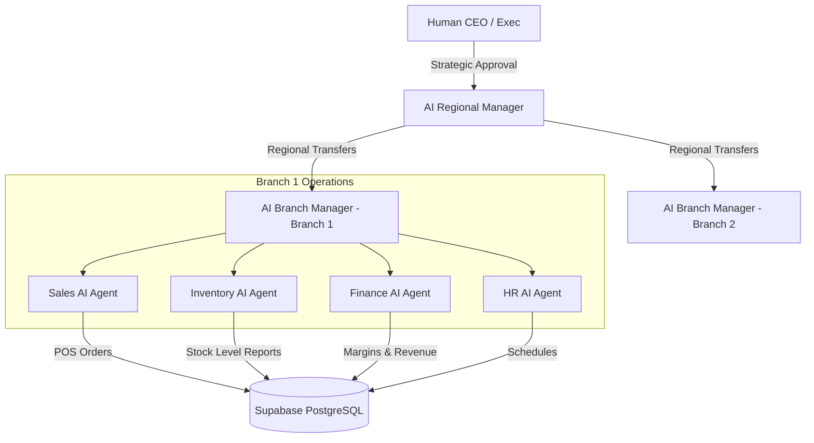

# Nexus AI: The AI Operating System for Multi-Branch Pharmacy Chains

Nexus AI is an enterprise-grade AI Operating System designed specifically for modern pharmacy chains (modeled around **NexusCare Pharmacy**, with a target footprint of 10 branches in Hyderabad). Moving beyond traditional static Enterprise Resource Planning (ERP) systems, Nexus AI deploys a collaborative AI Digital Workforce. The platform automates routine branch workflows while delivering explainable recommendations to human stakeholders for high-risk strategic decision-making.

---

## 1. System Architecture & Multi-Agent Framework

Nexus AI orchestrates a hierarchical multi-agent network using **FastAPI**, **LangGraph**, and **Gemini 2.5 Flash**. The agents communicate and make decisions governed by human-in-the-loop policies.



### Agent Roles & Responsibility Matrix
*   **Sales AI**: Handles customer interactions, monitors digital checkouts, and processes drug dispensing requirements at the POS.
*   **Inventory AI**: Predicts stock shortages, manages local safety stock thresholds, and flags batch expiries.
*   **Finance AI**: Approves margin updates and calculates discounts and branch-level overheads.
*   **HR AI**: Organizes staff rosters and shifts based on peak hours.
*   **AI Branch Manager**: Aggregates local telemetry and coordinates execution of local workflows.
*   **AI Regional Manager**: Focuses on inter-branch operations (e.g., executing drug stock transfers from surplus branches to branches facing shortages).

---

## 2. Role-Based Access Control (RBAC) Specification

Access permissions are enforced across all dashboard paths. The system dynamically loads widgets, metrics, and sidebars based on the user's role scope.

| Feature / Page | CEO / Admin | Regional Manager | Branch Manager | Pharmacist / Staff |
| :--- | :---: | :---: | :---: | :---: |
| **CEO Dashboard** (`/dashboard`) | View Global | View Regional Only | View Branch Only | Denied |
| **AI Command Center** (`/dashboard/ai-command-center`) | full | Read-Only | Denied | Denied |
| **Branch Operations** (`/dashboard/branch`) | View All | View Region | View Local | Denied |
| **Finance Modules** (`/dashboard/finance`) | full | Denied | Denied | Denied |
| **Medicine Intelligence** (`/dashboard/medicines`) | full | Read-Only | View Local | View Local |
| **Approvals Queue** (`/dashboard/approvals`) | Global | Regional | Local | Denied |
| **Roster / Employee Profiles** (`/dashboard/employees`) | View All | Read-Only | Manage Local | Denied |
| **Customer Registry** (`/dashboard/customers`)| View All | Read-Only | Manage Local | View Local |

---

## 3. Project Directory Structure

```text
nexus_ai/
├── apps/
│   ├── api/                    # FastAPI Backend Server
│   │   ├── app/
│   │   │   ├── ai/             # LangGraph, RAG & Agents Engine
│   │   │   │   ├── agents/     # Sales, Inventory, Finance, HR Agents
│   │   │   │   └── tools/      # Vector db Search and POS tools
│   │   │   ├── api/            # REST API endpoints (orders, workflow, system)
│   │   │   └── core/           # Security, session, and DB configurations
│   │   └── main.py             # Uvicorn entry point
│   │
│   └── web/                    # Next.js Frontend Application
│       ├── src/
│       │   ├── app/            # Next.js App Router (Dashboard, Login, Settings)
│       │   ├── components/     # UI components (Layout, Topbar, Sidebar, Copilot Drawer)
│       │   ├── context/        # SessionContext (Auth, Fallback Profile Mocking)
│       │   └── lib/            # Utilities and supabase helper connections
│
├── packages/
│   └── database/               # Database Schemas & Migrations (Supabase/Postgres)
```

---

## 4. Getting Started & Developer Setup

### Prerequisites
*   **Node.js**: `v18.x` or higher
*   **Python**: `v3.10.x` or higher
*   **Supabase PostgreSQL Database**

### 1. Backend API Local Setup
1. Navigate to the api workspace:
   ```bash
   cd apps/api
   ```
2. Set up virtual environment and install dependencies:
   ```bash
   python -m venv venv
   source venv/bin/activate  # On Windows use: venv\Scripts\activate
   pip install -r requirements.txt
   ```
3. Configure your local `.env` variables (e.g. Supabase credentials, xAI API key).
4. Run the development Server:
   ```bash
   uvicorn app.main:app --reload --port 8000
   ```

### 2. Frontend Local Setup
1. Navigate to the web workspace:
   ```bash
   cd apps/web
   ```
2. Install npm pack dependencies:
   ```bash
   npm install
   ```
3. Build & start dev portal:
   ```bash
   npm run dev
   ```
   Open [http://localhost:3000](http://localhost:3000) inside your web browser.


