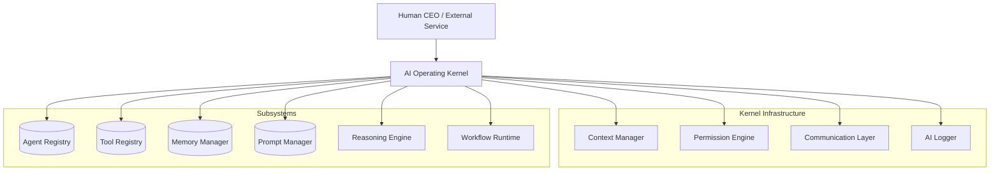

# Nexus AI — Operating Kernel

The AI Operating Kernel acts as the orchestration layer for the multi-agent Nexus architecture. It implements core operational infrastructure required *before* models like Gemini or frameworks like LangGraph are wired in. 

> Note: The Kernel contains NO hardcoded business logic. It provides interfaces for routing requests, maintaining distributed memory states, orchestrating tool executions safely, and logging the underlying reasoning chains.

## Architecture Diagram

## Structure
- `agents/`: Core interfaces for AI Agents.
- `communication/`: Message bus bridging agent-to-agent interactions.
- `context/`: Wraps execution boundaries (org, user, branch).
- `exceptions/`: Typed internal faults logic.
- `kernel/`: The central `AIKernel` Facade coupling subsystems.
- `logging/`: Persistent auditing for reasoning decisions.
- `memory/`: Interfaces for RAG, Short/Long-term state transitions.
- `models/`: Strictly typed Pydantic payloads.
- `permissions/`: Engine evaluating user RBAC mapped to AI operations.
- `prompts/`: Versioned template formatting system.
- `reasoning/`: Chains and logic extraction definitions.
- `registry/`: Fast in-memory map of system capabilities (agents & tools).
- `tools/`: Atomic business logic invocation wrappers.
- `workflow/`: Suspend/Resume orchestrations bridging graphs.
