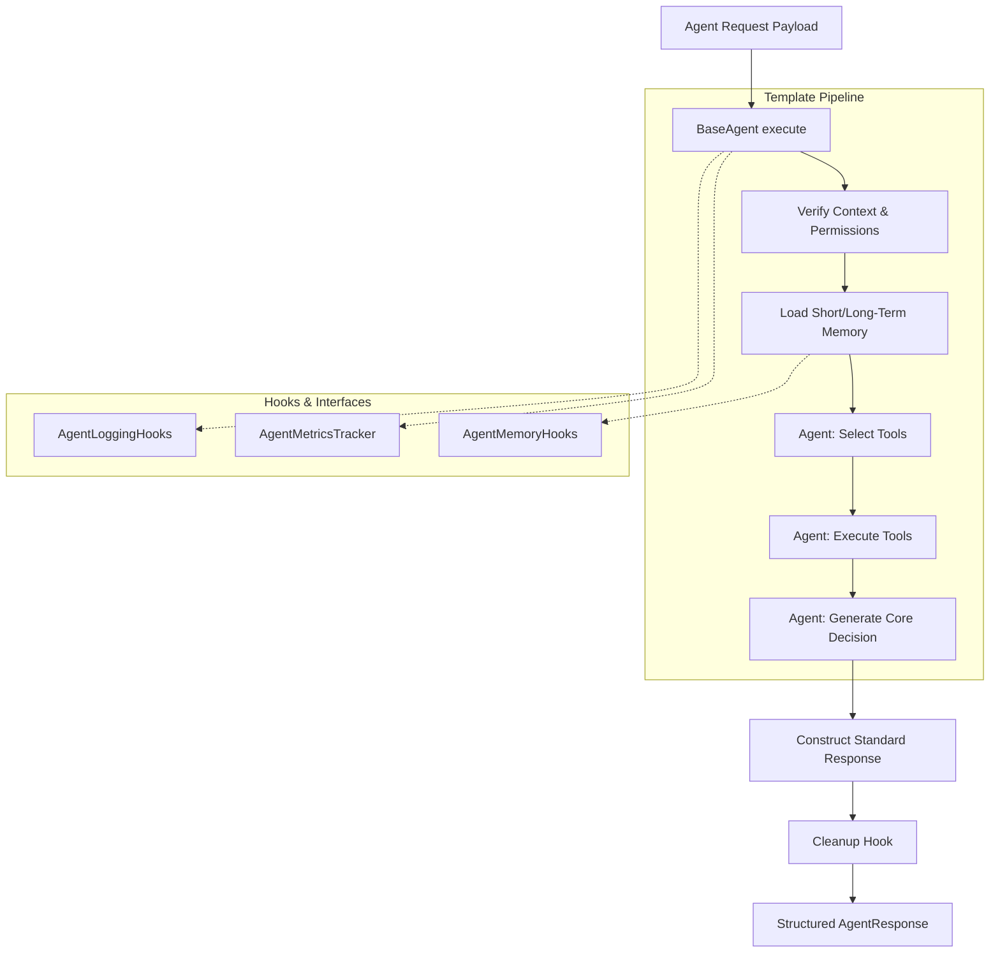

# Nexus AI — Reusable Agent Architecture

The Agent Framework is a foundational, reusable architecture providing strict lifecycle, execution, and boundary limits for all future business agents (like Sales AI, Inventory AI, etc.). 

It implements the **Template Method Pattern**, enforcing the pipeline via the `BaseAgent.execute()` method, and ensuring developers can only inject model logic in safe hook points (`select_tools`, `execute_tools`, `generate_response`).

## Agent Lifecycle State Machine
`IDLE -> RUNNING -> (WAITING) -> COMPLETED | FAILED`

## Agent Architecture Boundary

## Structure
- `base/agent.py`: `BaseAgent` class driving the execution structure.
- `interfaces/hooks.py`: Observers and decoupled tracking integrations.
- `models/core.py`: Strictly typed request/response/context bundles.
