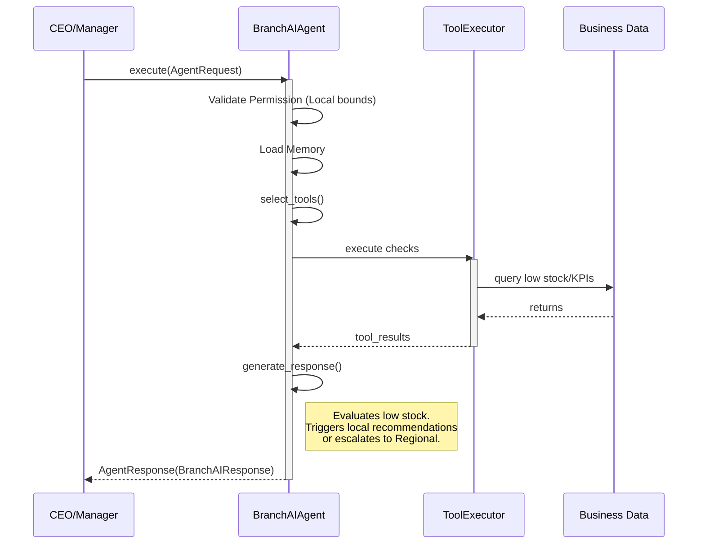

# Branch AI Agent

The `BranchAIAgent` handles operations scoped exclusively to a single pharmacy location. It sits beneath the `RegionalAIAgent` and orchestrates data provided strictly from that branch.

It extends the safe `BaseAgent` boundaries.

## Architecture

## Responsibilities
- Track expiry mappings locally.
- Recommend local reorder schedules vs transfer requests.
- Track metrics (Order efficiency, staff productivity).
- Issue immediate escalations to Regional bounds for network shortages.
