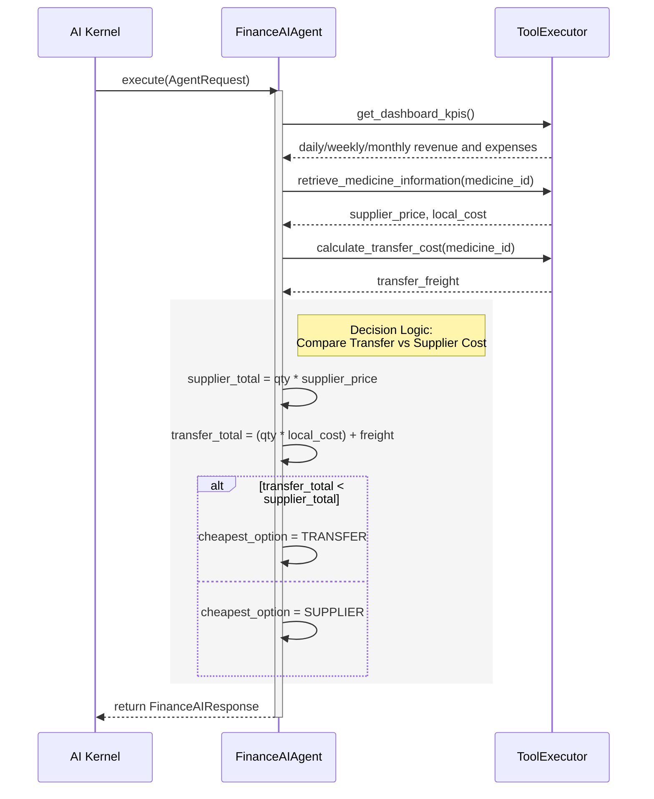

# Finance AI Agent

The `FinanceAIAgent` manages financial performance tracking, profit margin safety gates, invoice generation hooks, and procurement decision trees.

It evaluates whether to trigger local inter-branch stock transfers or request external supplier purchases.

## Architecture

## Business Rules & Savings Logic
1. **Procurement Comparison**: Calculates standard total purchase costs against network transfer costs (local item cost + freight charges). Recommends the action yielding the highest net savings path.
2. **Branch Profitability Scoring**: Analyzes expenses (salaries, utilities, waste) against daily revenue snapshots to compute margins.
3. **Billing and Audits**: Prepares structured invoice and savings details for dashboard display or API reporting.
