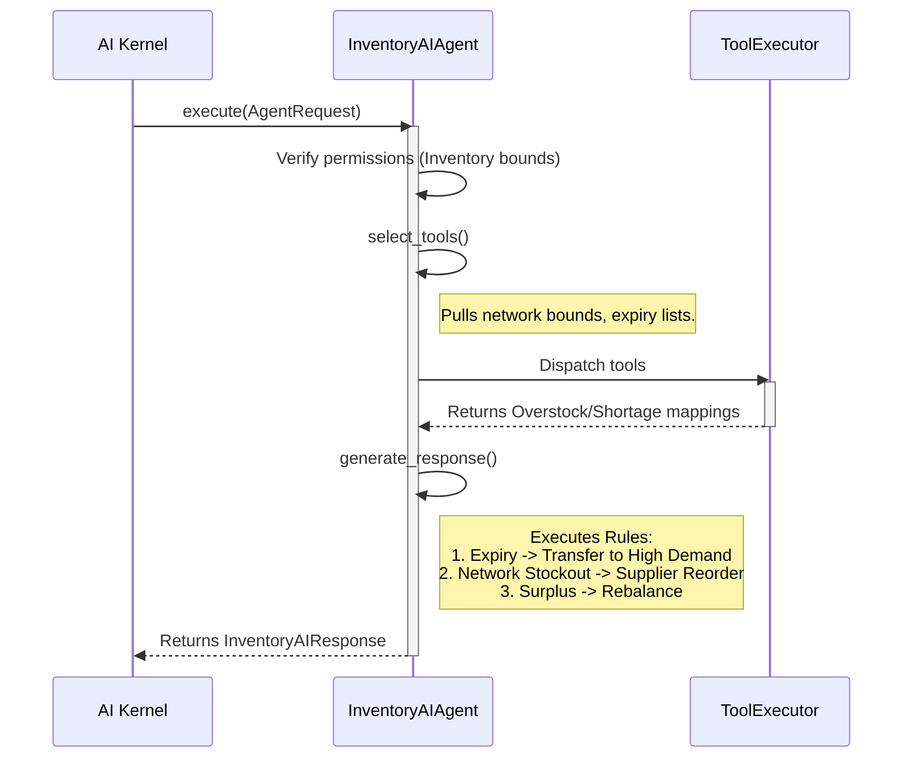

# Inventory AI Agent

The `InventoryAIAgent` acts as the primary telemetry mapping intelligence layer for stock optimization. It collaborates closely with `BranchAI` and `RegionalAI` boundaries, specifically monitoring reorder algorithms, supply chain thresholds, turnover velocity, and network-wide dead-stock isolations.

## Architecture & Integration

This Agent acts deterministically under the `BaseAgent` abstraction bounds, utilizing only registered inventory tool capabilities.

## Business Rules Tracked
- Dead Stock Identification
- Automated Branch-to-Branch Stock Transfers (preferring Network balancing over direct supplier injection)
- Expiry Hazard Ratios
- Turnover KPI Tracking
