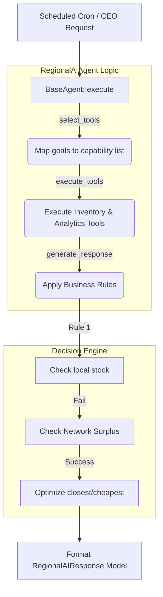

# Regional AI Agent

The `RegionalAIAgent` acts as the highest-level operational intelligence layer, extending the `BaseAgent` framework. It coordinates all downstream branches, recommends network-wide optimizations (stock balancing), and formats executive summaries for the CEO.

## Architecture & Integration

This Agent strictly follows the Template Method Pattern declared in `BaseAgent`, injecting its logic into `select_tools`, `execute_tools`, and `generate_response`. 

> NOTE: The Regional Agent is fully isolated from business Repositories. It operates blindly by sending payloads through the isolated `ToolExecutor`. 

## Business Rules Implemented
1. If stock local -> Stop.
2. If stock empty -> Find network surplus.
3. Multiple surpluses -> Rank by lowest freight and shortest distance.
4. Expiry > Threshold -> Force transfer to high-usage node.
