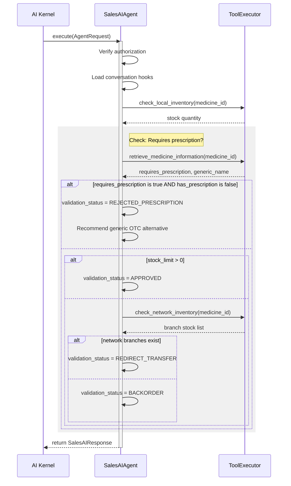

# Sales AI Agent

The `SalesAIAgent` evaluates incoming customer checkout orders, enforces prescription checking logic, resolves pricing structures, and performs generic medicine substitutions.

It interfaces with the environment strictly via standard tools, following the clean architecture guidelines of the `BaseAgent` framework.

## Architecture

## Configured Rules
1. **Prescription Security Gate**: Automatically stops pharmacy orders referencing scheduled medicines if the validation context has `allows_unrestricted` flag or prescription parameters set to false. Recommends over-the-counter equivalents.
2. **Dynamic Stock Balancing**: Redirects order workflows into Transfer proposals if local stock runs out but network locations possess inventory.
3. **Backorder Resolution**: Triggers supplier replenishment events when network-wide depletion is verified.
