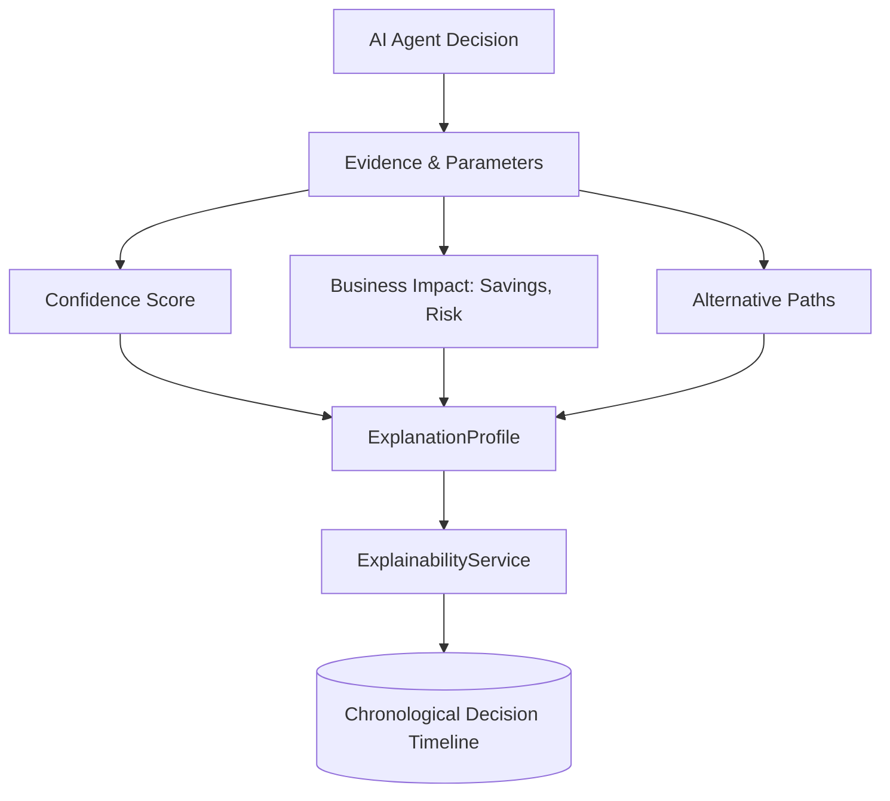

# Explainability Engine (XAI)

The Explainability Engine assures that every AI recommendation, transaction routing, and margin adjustments computed by Nexus AI are auditable, justifiable, and explainable.

The engine coordinates:
- **`EvidenceCollector`**: Traces specific knowledge chunks, document names, and active tools.
- **`ConfidenceCalculator`**: Scores trust levels based on prescription availability and stock ratios.
- **`BusinessImpactCalculator`**: Quantifies dollar-valued savings and maps risk profiles.
- **`AlternativeActionGenerator`**: Generates alternative execution options.
- **`TimelineTracker`**: Chronologically logs agent decisions.

## Explainability Graph

