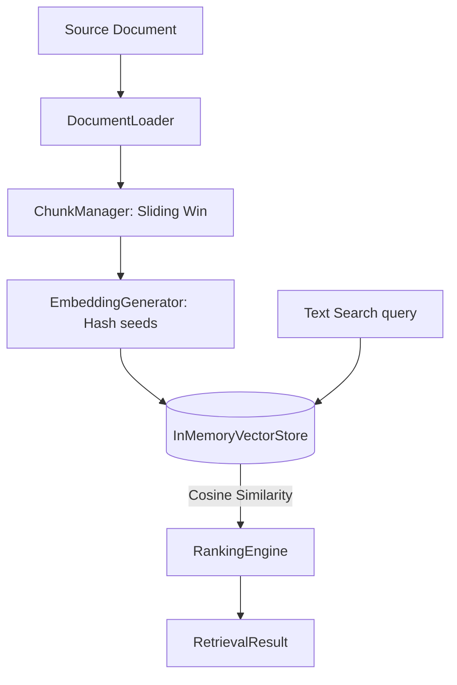

# RAG Knowledge Intelligence Layer

The `KnowledgeService` RAG framework ingests enterprise standard operating procedures, guidelines, compliance files, and contracts.

It slices text content into indexable chunks, generates deterministic vector embeddings, and executes cosine similarity searches.

## Architecture

## Retrieval Output Format
Query matches return:
- **`relevant_chunks`**: Matched slices of raw texts.
- **`metadata`**: Origin filename, type, and creation date.
- **`confidence` & `similarity_score`**: Normalized cosine coefficients.
