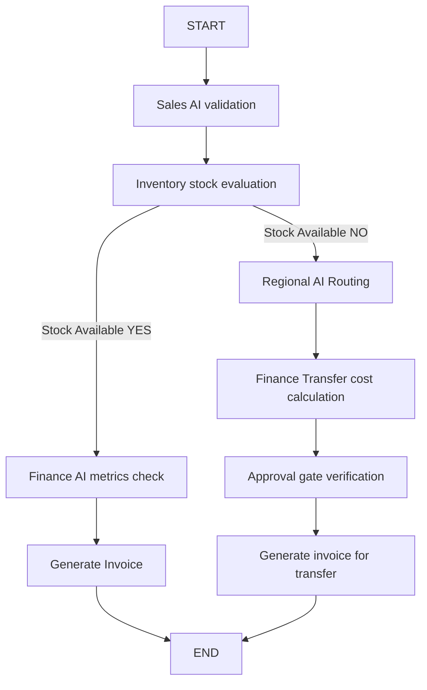

# LangGraph Multi-Agent Orchestration

The `app/ai/langgraph` module replaces hardcoded pipeline executions with a flexible, stateful `StateGraph`.

## Graph Topology

The orchestration sequence supports conditional redirects:

## Configured State
- **`GraphWorkflowState`**: Structured as a TypedDict containing localized keys mirroring existing schemas, trace trackers, latency tracking dicts, and intermediate output stores.
- **Checkpointers**: Uses standard `MemorySaver` in-memory checkpoints to enable thread resolution, state recovery, and tracing details.
