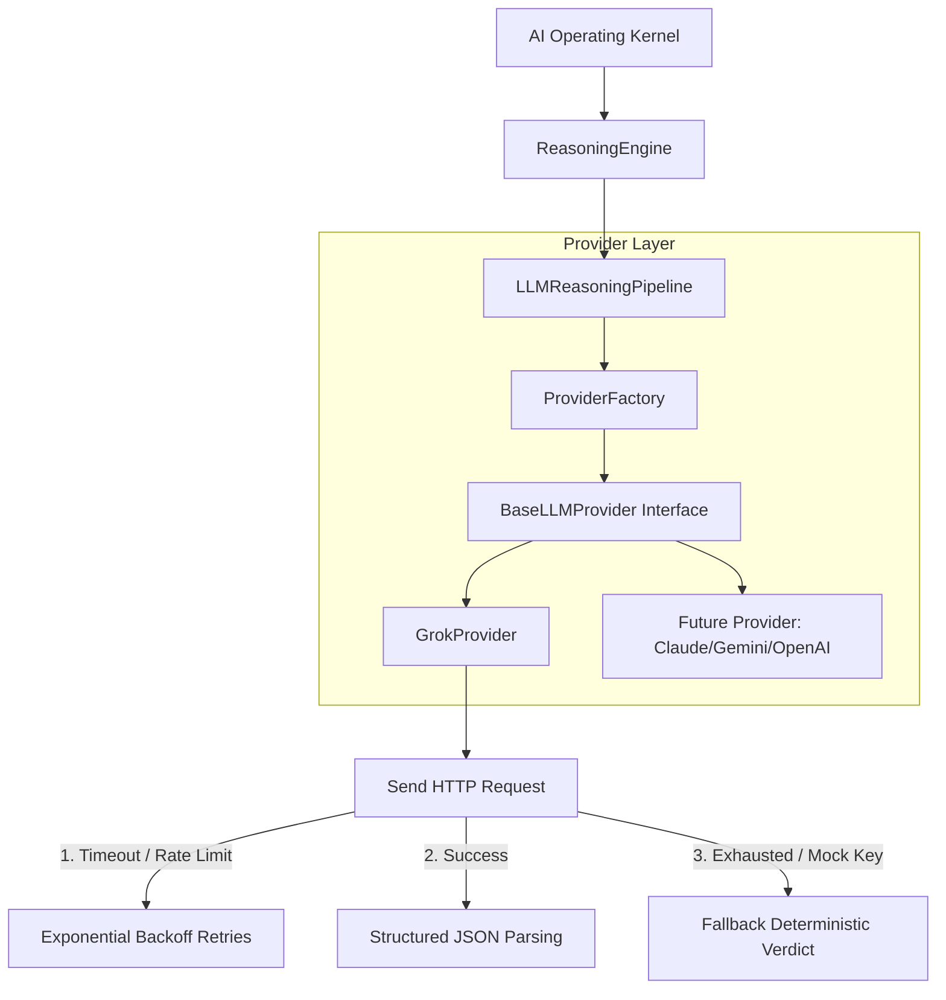

# LLM Provider Layer & Grok Integration

This layer decouples the Nexus AI Operating Kernel from specific LLM models, standardizing calls via the `BaseLLMProvider` contract. 

It provides an out-of-the-box concrete implementation for the **xAI Grok API** with automated timeout Handling, exponential backoff retries, cost tracking, and failsafe fallback systems.

## Architecture

## JSON Formatting Rules
Requests directed to LLM providers enforce JSON output matches strict schemas. In the event of schema breaches or API outages, a deterministic, risk-free JSON fallback is executed to prevent runtime crashes.
