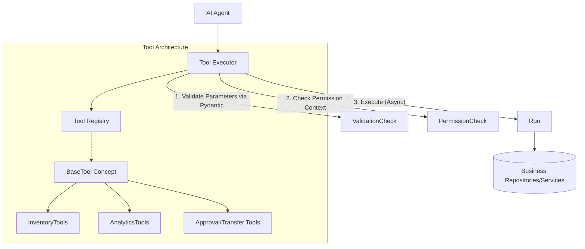

# Nexus AI — Tool Layer Architecture

The Nexus AI Tool Layer provides a secure, validated boundary allowing AI agents to interact with the underlying business logic, without directly coupling to database layers.

## Architecture



## Creating New Tools
All tools are subclasses of `BaseTool`, implementing `input_schema`, `output_schema`, and `execute`. By decorating a class with `@register_tool`, it becomes automatically available.

```python
from app.ai.tools.base import register_tool, BaseTool, ToolMetadata

@register_tool
class ExampleTool(BaseTool):
    metadata = ToolMetadata(name="example", description="...", category="misc")
    input_schema = ExampleInputModel
    output_schema = ExampleOutputModel
    
    async def execute(self, params: ExampleInputModel, context: dict) -> ExampleOutputModel:
        # Logic...
        pass
```
