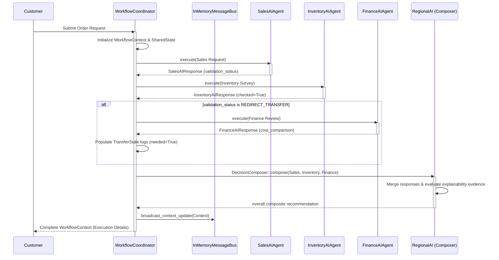

# Agent Collaboration & Multi-Agent Orchestration

This module coordinates active collaboration between business agents (Sales, Inventory, Finance, Regional) using the AI Operating Kernel to parse customer purchase events.

## Collaborative Ordering Sequence

## State & Metrics Captured
- **`SharedBusinessState`**: Enforces strict fields bounding Order, Inventory, Transfer, Approval, Invoice, and Notifications.
- **`CollaborationMetrics`**: Logs workflow duration, individual agent processing latencies, and total message counts.
