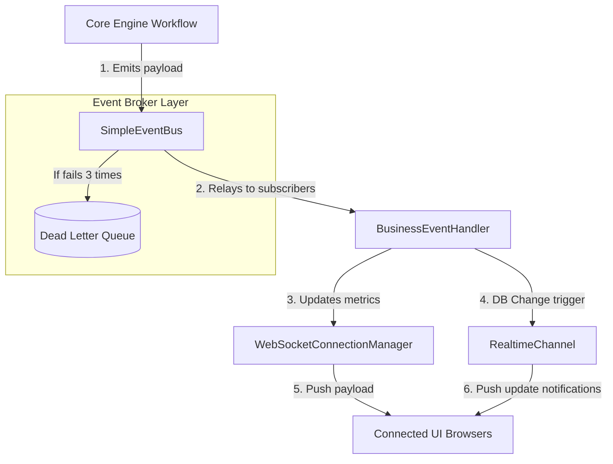

# Enterprise Event & Realtime System

The `app/events/` module shifts Nexus AI into a reactive, event-driven architecture. 

It tracks and broadcasts database updates, inventory mutations, and decision updates instantly contextually.

## Realtime Message Loop

## Security Profiles
- **Organization Isolation**: Event broadcasts sanitize packages using `organization_id` matching rules.
- **WebSocket Auth**: Authenticators match credentials tokens to active subscriber tracks.
