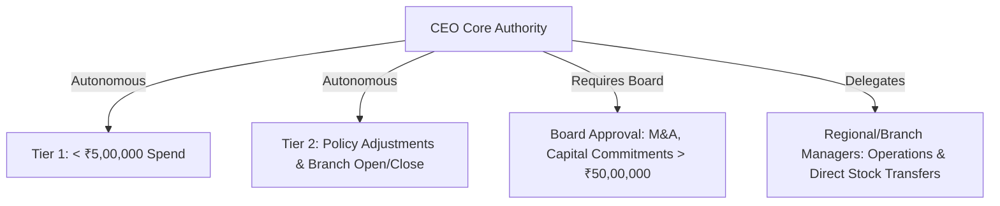
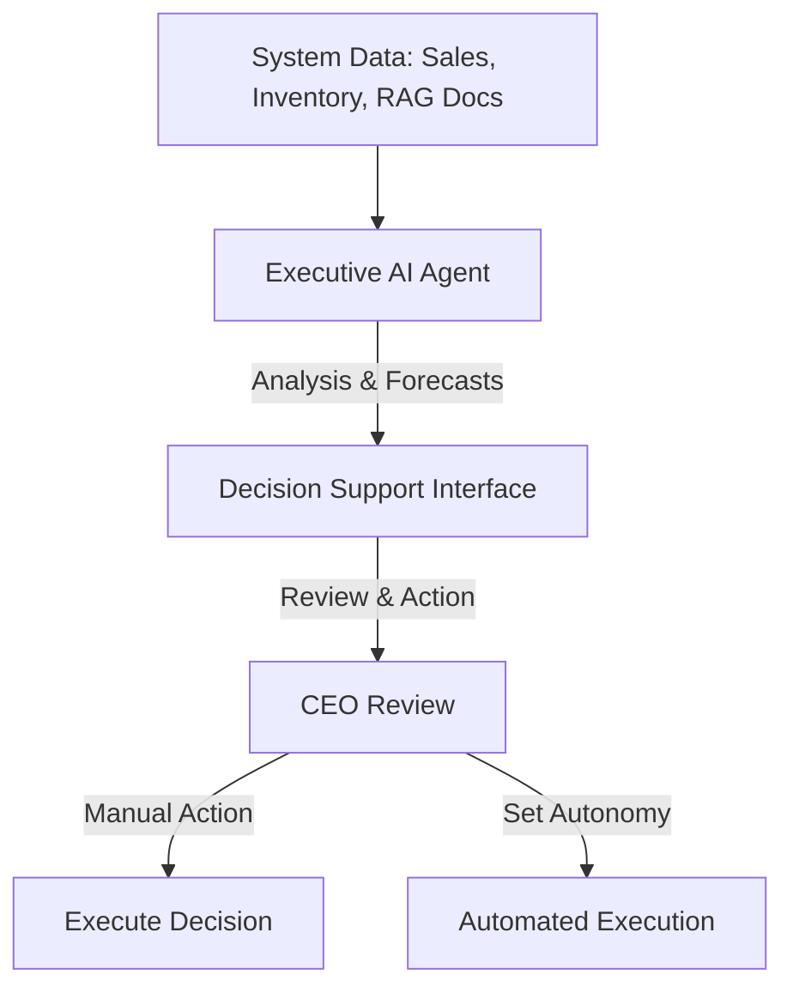

# Nexus AI - CEO Role Functional Specification
**Enterprise-Grade Operating System for Multi-Branch Pharmacy Chains**

---

## 1. Executive Role Overview

The Chief Executive Officer (CEO) is the primary strategic leader of the entire pharmacy chain organization. The CEO is responsible for high-level governance, profitability, growth velocity, and general regulatory health across all branches. The role focuses strictly on macro-operations, network analytics, and multi-agent coordination, completely isolated from day-to-day retail dispensing tasks.

```
+-------------------------------------------------------------+
|                         CEO ROLE                            |
|             Network Governance & Strategy                   |
+-------------------------------------------------------------+
                               |
                               v
   +-------------------------------------------------------+
   |   Strategic Goals:                                    |
   |   - Operational Efficiency (Sales Conversion)         |
   |   - Profit Margin Optimization                        |
   |   - AI-Driven Logistics Optimization                  |
   +-------------------------------------------------------+
```

### Strategic Goals & Business Objectives
* **Market Expansion:** Expand market share through targeted regional establishment and network integration.
* **Profitability:** Meet network-wide profit margin targets through auto-replenishment, dynamic markdown algorithms, and shrinkage/pricing optimization.
* **Operational Efficiency:** Optimize the logistics pipeline, min-max stock layouts, and branch-level inventory transfer speeds.
* **Compliance & Security:** Enforce zero-trust clinical compliance, tracking narcotics, high-value molecules, and pharmacist audits.

### Governance Calendar & Operations Schedule
The CEO’s operational responsibilities are organized into structured, cyclic activities:

#### Daily Responsibilities
* **Network Health Scan:** Review overnight sales totals, audit trails, and automatic transfer execution lists.
* **Security & Failure Audits:** Verify security policy alerts, credential bypass events, or anomalous inventory transfers.
* **Executive Summary Check:** Review the daily AI recommendations queue for supply disruptions and critical stock outages.

#### Weekly Responsibilities
* **Regional Performance Reviews:** Compare branch conversion targets, regional revenues, and inventory levels.
* **Delegation Audits:** Review approvals handled by Branch Managers or Regional Managers.
* **Vendor Contract Compliance:** Track supplier performance metrics, fulfillment rates, and delivery time deviations.

#### Monthly Responsibilities
* **Financial Ledger Closures:** Approve profit-and-loss statements, tax invoices, and branch margins.
* **RAG Training Assessment:** Inspect AI performance logs, decision accuracy rates, and knowledge base updates.
* **Branch Policy Review:** Assess policy rules, discount levels, and automated procurement limits.

#### Quarterly Responsibilities
* **Regional Expansion Evaluation:** Review proposed locations, capital expenditure reports, and competitor studies.
* **Employee Compliance Audit:** Audit shift patterns, training logs, and roles access history.
* **Supplier Contract Review:** Initiate contract renewals or modifications based on logistics efficiency data.

#### Annual Responsibilities
* **Strategic Planning:** Approve the company's annual budget, expansion priorities, and digital transformation goals.
* **Governance Model Updates:** Review the organization's RBAC matrix, regulatory protocols, and risk tolerances.

---

## 2. Business Authority & Governance

The CEO operates under a strict delegation of authority framework established by the board of directors.



### Approval Thresholds & Sign-Off Tiers
The CEO's financial sign-off limits are structured into three main categories:
1. **Tier 1 (Autonomous):** Expenditure up to **₹5,00,000** for inventory replenishment, IT licensing, and local equipment maintenance.
2. **Tier 2 (Autonomous):** Strategic decisions, including adjusting pricing rules, altering inventory safety stock levels, and updating regional staffing limits.
3. **Tier 3 (Board Approval Required):** Capital expenditures exceeding **₹50,00,000**, business acquisitions, and branch property acquisitions or leases.

### Delegation Matrix
* **Branch Managers:** Authorized to approve branch-level expenses up to **₹25,000**, handle customer loyalty point adjustments, and process standard, non-narcotic stock transfers.
* **Regional Managers:** Authorized to approve inter-branch transfers, regional vendor purchases up to **₹1,00,000**, and regional employee scheduling.
* **Internal Audit Team:** Delegated authority to inspect ledger compliance and access system audit logs.

### Emergency Powers & Fail-Safe Protocols
In high-risk scenarios (such as global supply chain failures, data breaches, or natural disasters), the CEO can activate **Emergency Mode**. This grants the following privileges:
* **Overriding Safety Stock Policies:** Dynamically reallocate resources to priority healthcare sites.
* **Temporary Vendor Setup:** Bypass standard procurement processes to establish alternative supply chains for critical medicines.
* **Security Controls:** Temporarily restrict system access, freeze database updates, and suspend background AI automation to protect data integrity.

---

## 3. Executive Dashboard Architecture

The dashboard provides a real-time, high-level overview of the pharmacy network's operations, combining transactional data with predictive analytics.

```
+-------------------------------------------------------------------------+
| [ Topbar: Search, Role Selection, Active System Alerts Indicator ]       |
+-------------------------------------------------------------------------+
|  KPI Summary cards:                                                     |
|  [ Revenue: ₹4.82 Cr ] [ Net Profit: ₹1.42 Cr ] [ Stock Value: ₹8.4 Cr ] |
+-------------------------------------------------------------------------+
|                                  |                                      |
|  [ Regional Revenue Chart ]      |  [ AI Supply Chain Recommendations ] |
|  Visualizes branch performances  |  Urgent stock-out forecast           |
|                                  |                                      |
+-------------------------------------------------------------------------+
|                                                                         |
|  [ Audit Logs & Security Events Table ]                                 |
|  Real-time system updates and access events                             |
|                                                                         |
+-------------------------------------------------------------------------+
```

### Core Performance KPIs
* **Network Revenue:** Total sales across all branches, excluding taxes and returns.
* **Net Profit Margin:** Consolidated earnings after subtracting cost of goods sold (COGS), operating expenses, and tax liabilities.
* **Consolidated Inventory Value:** Total value of stock at cost price, updated in real time.
* **Stock Obsolescence Rate:** The percentage of inventory nearing expiration (within 90 days) or categorized as dead stock (unsold for over 60 days).
* **AI Task Autoresolution Rate:** The percentage of system tasks (reorder recommendations, inventory reallocations) completed by AI agents without manual intervention.

### Dashboard Widgets

| Widget Name | Data Source | Visualization Type | Purpose |
| :--- | :--- | :--- | :--- |
| **Financial Health Monitor** | `invoices`, `payments`, `expenses` | Multi-line Trend (Revenue vs. Expenses) | Displays cash flow changes and net profit trends. |
| **Regional Sales Heatmap** | `branches`, `orders` | Interactive Geographical Chart | Compares sales density and regional performance. |
| **Stock Expiry Risk** | `inventory`, `medicine_batches` | Stacked Bar Chart | Groups inventory by expiry risk (critical, warning, safe). |
| **Autonomic Pipeline Audit** | `ai_tasks` | Funnel Chart | Traces AI decisions from creation to execution and manual review. |
| **Dynamic Worklist** | `approvals`, `notifications` | Interactive Status List | Displays pending regional transfers, high-value expenditures, and compliance alerts. |
| **Sales Performance Matrix** | `view_branch_margin_performance` | Sorted Table | Ranks branches by net profit, sales volume, and average order value. |

---

## 4. Permissions (RBAC Matrix)

The CEO has read-only access to standard branch operations and complete read, write, and approval control over strategic configurations.

| Entity name | Read | Create | Update | Delete | Approve / Reject |
| :--- | :---: | :---: | :---: | :---: | :---: |
| **Organizations & Branches** | Included | Included | Included | Excluded | Included |
| **User Profiles & Roles** | Included | Included | Included | Excluded | Included |
| **Medicines & Batches Catalog** | Included | Excluded | Excluded | Excluded | Excluded |
| **Inventory Stock Levels** | Included | Excluded | Excluded | Excluded | Excluded |
| **Inter-Branch Stock Transfers** | Included | Included | Included | Included | Included |
| **Invoices & Transactions** | Included | Excluded | Excluded | Excluded | Excluded |
| **AI Agents & Tasks** | Basic | Included | Included | Included | Included |
| **Audit Logs & Telemetry** | Included | Excluded | Excluded | Excluded | Excluded |
| **System Settings & Policies** | Included | Included | Included | Excluded | Included |

---

## 5. Functional Modules

### A. Enterprise Organization & Branch Control
* **Purpose:** Allows the CEO to manage organizational settings, create or update branch profiles, and configure operational variables.
* **CEO Capabilities:** Add new branch profiles, set location parameters, and define regional groupings.

### B. Inventory & Global Stock Intelligence
* **Purpose:** Provides a real-time, network-wide view of inventory levels, stock values, and batch statuses.
* **CEO Capabilities:** Track safety stock thresholds, analyze inventory run rates, and identify slow-moving or close-to-expiry stock.

### C. Inter-Branch Logistics & Transfers
* **Purpose:** Manages stock reallocations between branches to optimize inventory distribution.
* **CEO Capabilities:** Review, approve, or reject transfer proposals, and track delivery progress.

### D. Finance & Margin Performance
* **Purpose:** Tracks consolidated revenues, cost of goods sold (COGS), operating expenses, and margins.
* **CEO Capabilities:** Compare branch performance, analyze profit trends, and evaluate pricing strategies.

### E. AI Workforce Command Suite
* **Purpose:** Oversees the platform's multi-agent system, monitoring agent activity, decision outputs, and accuracy rates.
* **CEO Capabilities:** Adjust agent autonomy levels, review recommendations, and check explainability logs.

### F. RAG Knowledge Center
* **Purpose:** Stores the organization's standard operational templates, regulatory rules, and clinical compliance documents.
* **CEO Capabilities:** Upload regulatory updates and training materials to refine AI reasoning.

### G. Audit Logs & System Telemetry
* **Purpose:** Tracks system activity for security, compliance, and troubleshooting purposes.
* **CEO Capabilities:** Filter logs by event category, user ID, severity rating, and timestamp.

---

## 6. Business Workflows

### A. Setting Up a New Branch
```
[CEO] Selects "Create Branch"  --> [System] Checks Code Uniqueness
                                            |
                                            v
[AI] Matches Pre-Approved Settings <-- [CEO] Confirms Address
```
1. The CEO opens the Branch module and clicks **Create Branch**.
2. Input branch code, name, geographic location, and tax parameters.
3. The AI agent generates a baseline configurations profile (inventories lists, billing parameters) based on similar local branches.
4. The CEO reviews, edits, and activates the branch.

### B. High-Value Expenditure Approval
```
[AI] Multi-Agent Flags Purchase Request > Limit
                    |
                    v
[CEO Dashboard] Pending Action List Alert
                    |
                    v
[CEO] Approves Contract --> [System] Unlocks PO & Triggers Supplier Order
```
1. An automated restocking run generates a purchase request exceeding a manager's local sign-off limit.
2. The system places the order in the CEO's pending approval queue and sends a high-priority alert.
3. The CEO reviews the order details, sales forecasts, and vendor terms.
4. The CEO either approves the order (triggering the supplier purchase) or rejects it (returning it for adjustment).

---

## 7. AI Integrations, Models & Decision Support

Nexus AI uses a multi-agent system to support executive decision-making.



### Multi-Agent Framework Detail
* **Executive AI Agent:** Integrates data from other agents to generate concise summaries, trend analyses, and strategic options for the CEO.
* **Finance Agent:** Analyzes transaction patterns, flags anomalies, and forecasts cash flow, revenue, and margins.
* **Inventory Agent:** Monitors stock levels, expiration risks, and lead times to calculate optimal reorder points.
* **Regional Risk Agent:** Evaluates regional factors like transport times, local demand shifts, and regulatory changes to flag supply risks.

### Decision Interface Specifications
Each recommendation includes:
1. **Context Summary:** A clear explanation of the situation and the primary cause.
2. **Analysis Details:** Clear data visualizations showing the logic behind the recommendation.
3. **Proposed Action:** Clear steps to resolve the issue.
4. **Calculated Confidence:** A confidence score based on data completeness and historical accuracy.
5. **Alternative Scenarios:** A list of alternative options and their expected outcomes.

---

## 8. Executive Reports Engine

The reporting engine allows the CEO to schedule and generate comprehensive performance reports.

| Report Title | Frequency | Format Options | Core Data Points |
| :--- | :--- | :--- | :--- |
| **Financial Ledger Closure** | Monthly / Quarterly | PDF, Excel | Revenues, COGS, margins, regional comparisons. |
| **Inventory Obsolescence Study** | Weekly / Monthly | CSV, PDF | Expiery risks, slow-moving items, storage costs. |
| **AI Decisions & Outcomes Report** | Monthly | PDF | Auto-resolution counts, manual overrides, system accuracy metrics. |
| **Audit Log Compliance Ledger** | Weekly / Quarterly | PDF | Security alerts, role bypass events, database mutation histories. |

---

## 9. Alerts & Notifications Suite

The notification system uses three priority tiers to organize system alerts:

* **High Priority (Critical):** Displayed as a modal alert on login. Email and SMS alerts are sent instantly.
  * *Triggers:* Security breaches, Narcotics discrepancies, Inventory shortages of critical medicines.
* **Medium Priority (Warning):** Added to the dashboard alert panel.
  * *Triggers:* Expiry warnings for significant batches, Regional shipment delays.
* **Low Priority (Info):** Logged in the audit panel.
  * *Triggers:* Completion of routine transfers, System backups.

---

## 10. Global Search Capabilities

The search system index includes:

* **Scope of Index:** Branches, employees, vendors, invoices, inventory SKU levels, transfer records, and AI decision histories.
* **Search Mechanics:** Supports partial matches, synonym queries, and filters for date ranges, branches, and transaction statuses.
* **System Traceability:** The search results link directly to detailed views, invoices, or transfer logs to simplify navigation.

---

## 11. Advanced Analytics Core

### Predictive Analytics
* **Demand Forecasting:** Uses historical sales data, seasonal patterns, and regional health data to predict product-level demand.
* **Expiry Forecasting:** Flags batches expected to expire before being sold, suggesting transfers to higher-velocity branches or promotional pricing.

### Financial Analytics
* **Cost Allocation Mapping:** Breaks down operating costs, logistics fees, and COGS to calculate true item-level profitability.
* **Margin Optimization Engine:** Recommends pricing adjustments based on demand, supplier costs, and competitor pricing.

---

## 12. Security & Compliance Architecture

The security model is designed to protect sensitive pharmacy and business data.

* **Authentication:** Integrated Single Sign-On (SSO) with Multi-Factor Authentication (MFA) required for all administrative access.
* **Authorization:** Role-Based Access Control (RBAC) maps permissions to specific roles. CEO permissions are restricted to organizational views.
* **Audit Trails:** All data modifications are logged with user ID, IP address, timestamp, and details of the change. Logs are encrypted to prevent unauthorized modification.

---

## 13. System API Specifications

The CEO dashboard interacts with the backend through the following key API endpoints:

### GET `/api/dashboard/summary`
* **Purpose:** Retrieves consolidated network financial and operational metrics.
* **Query Parameters:** `period` (e.g., `30d`), `region_id` (optional).
* **Response Schema (200 OK):**
```json
{
  "total_revenue": 48200000.00,
  "net_profit": 14200000.00,
  "roi_percentage": 29.46,
  "total_inventory_value": 84000000.00,
  "pending_transfers_count": 14,
  "ai_autonomy_rate": 84.5
}
```

### GET `/api/branches`
* **Purpose:** Returns a list of branches with operational indicators.
* **Response Schema (200 OK):**
```json
[
  {
    "id": "b1111111-1111-4111-9111-111111111111",
    "name": "Banjara Hills Branch",
    "city": "Hyderabad",
    "region": "Telangana Central",
    "active_sku_count": 482,
    "current_margin": 42.1
  }
]
```

### POST `/api/transfers/{id}/approve`
* **Purpose:** Approves a pending inter-branch inventory transfer.
* **Response Schema (200 OK):**
```json
{
  "transfer_id": "t9876543-2222-3333-4444-555555555555",
  "status": "approved",
  "approver": "ceo_user_id",
  "timestamp": "2026-07-06T14:53:31Z"
}
```

---

## 14. Database Relational Mappings

The CEO role interacts with the following database tables:

* `organizations` (Read / Update): Enterprise profile details.
* `branches` (Read / Write / Update): Location profiles and active statuses.
* `users` & `user_roles` (Read / Write / Update): User profiles and role assignments.
* `invoices` & `payments` (Read-Only): Transaction records.
* `stock_transfers` & `transfer_items` (Read / Update): Logistics and inventory relocations.
* `ai_tasks` & `ai_reasoning` (Read / Write): AI decision tracking.
* `audit_logs` (Read-Only): Compliance and system event logs.

---

## 15. User Interface (UI) Specs

### Navigation & Layout
* **Sidebar:** Links to the CEO Dashboard, Branch Operations, Finance, Inventory, Transfers, AI Workforce, and Reports.
* **Topbar:** Features global search, organization context selectors, and notifications.

### Design System Requirements
* **Color Palette:** Professional dark theme using deep slate/zinc backgrounds, with high-contrast UI accents for markers.
* **Responsiveness:** Fluid grid layout optimized for screens from 12-inch tablets (landscape) to high-resolution desktop monitors.
* **Accessibility:** Meets WCAG 2.1 AA standards, ensuring readable text contrast, keyboard navigation support, and clear aria labels.

---

## 16. Future Scope & Roadmap

* **International Expansion:** Multi-currency, localized taxation, and international compliance settings.
* **IoT Cold Chain Integration:** Live temperature monitoring for sensitive biopharmaceuticals.
* **Autonomous Procurement:** AI agents negotiate pricing and initiate vendor contracts based on performance history.

---

## 17. Live Demonstration Walkthrough

During a demonstration, the CEO's workspace can be reviewed using this walkthrough:

```
[Login Screen] --> Enter CEO Credentials --> [Dashboard Page]
                                                  |
                                                  v
[Worklist Alert] <-- Click "Detail Link" <-- [Anomalous Spend Flagged]
        |
        v
[Detail View] --> Click "Approve Budget" --> [Success dialog] --> Logout
```

1. **Secure Login:** Log in as `ceo@nexuscare.com`.
2. **Dashboard Review:** Examine network metrics (Revenue, Margin, AI Autonomy Rate).
3. **Resolve Pending Action:** Click an alert flagging a high-value replenishment proposal.
4. **Audit and Decide:** Review the AI reasoning panel (sales forecast, vendor lead times) and click **Approve Spend**.
5. **Logs Verification:** Open the Audit Logs module to verify the action has been recorded.
6. **Logout:** Exit the session.

---

## 18. Acceptance Criteria

* **Network Performance Accuracy:** P&L reports and financial metrics must match the underlying transaction records precisely.
* **Decision Latency:** The system must process high-value approvals and trigger vendor integrations within 2 seconds.
* **Audit Trail Completeness:** All logins, policy changes, and approvals must log the user ID, timestamp, and action description.
* **RAG Content Ingestion:** New SOPs uploaded by the executive must be indexed and available for AI agent query expansion within 30 seconds.

---

## 19. System Edge Cases & Fail-Safes

* **Network Interruptions during Approval:** If the network disconnects during a spend approval, the transaction is rolled back, the request returns to a pending state, and a warning is shown.
* **AI Recommendation Engine Outage:** If the AI agent fails, the system reverts to rule-based logic (e.g., minimum stock levels) and notifies the administrator.
* **Seeded Account Access Failures:** In the event of a directory service outage, users can authenticate using secure local credentials. High-value approvals are suspended until centralized authentication is restored.

---

## 20. Production Readiness Checklist

- [ ] Run security audits on all API endpoints.
- [ ] Confirm proper database index strategies on foreign keys.
- [ ] Verify RLS policies are active on transaction tables.
- [ ] Add rate-limiting policies to the API gateway.
- [ ] Set up daily automated backups for organization metadata.
- [ ] Test the backup restore process in a staging environment.
