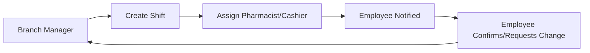
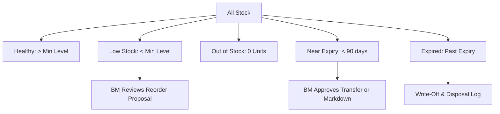
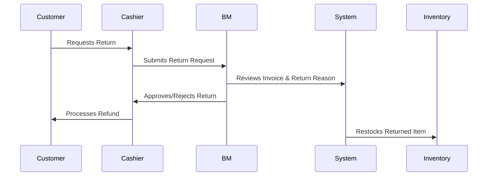
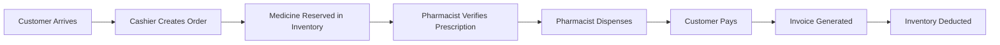
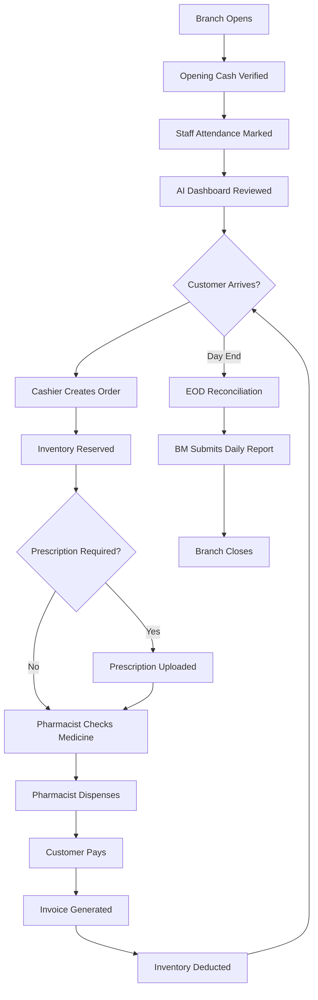

# Nexus AI - Branch Manager Functional Specification
**Enterprise Operating System for Multi-Branch Pharmacy Chains**

---

## 1. Branch Manager Role Overview

The Branch Manager (BM) is the single accountable leader for one physical pharmacy branch. The BM is responsible for the full operational lifecycle of that branch — from store opening to daily closing — including staff supervision, inventory accuracy, customer satisfaction, compliance adherence, and daily financial reconciliation.

The BM is the direct escalation point for cashiers and pharmacists and reports performance data upward to the Regional Manager.

### Purpose
To ensure the branch operates efficiently, safely, and profitably on a daily basis, while maintaining regulatory compliance and delivering quality customer service.

### Core Responsibilities
* Supervise all branch staff (pharmacists, cashiers, support).
* Maintain medicine availability by monitoring stock, approving transfers, and flagging shortages.
* Ensure all customer transactions are correctly billed and dispensed.
* Enforce pharmacy compliance rules (narcotics tracking, prescription verification).
* Submit accurate end-of-day financial and inventory reconciliations.

### Performance Goals & Operational KPIs

| KPI | Target | Measurement Frequency |
| :--- | :--- | :--- |
| **Daily Sales Revenue** | ≥ Daily Target | Daily |
| **Stockout Rate** | < 2% of active SKUs | Daily |
| **Order Fulfillment Rate** | ≥ 98% | Daily |
| **Customer Wait Time** | < 8 minutes | Hourly |
| **Billing Accuracy** | 100% | Daily |
| **Inventory Accuracy** | ≥ 99.5% | Weekly |
| **Expiry Write-off Rate** | < 0.5% of stock value | Monthly |

---

## 2. Daily Branch Operations

The Branch Manager follows a structured daily operational routine.

### Branch Opening Checklist (09:00 AM)
1. Unlock the premises and deactivate security.
2. Verify staff attendance against the scheduled shift roster.
3. Confirm POS terminals and printers are operational.
4. Review overnight inventory alerts (low stock, near-expiry) from the AI dashboard.
5. Verify the opening cash float in each billing counter.
6. Approve or reassign shifts for absent employees.
7. Brief pharmacists on any pending dispensing or restricted drug orders from the prior day.

### Intra-Day Operations (09:00 AM – 08:00 PM)
* Monitor customer queue lengths at billing counters.
* Approve customer refunds and returns within authority limits.
* Review and approve stock transfer requests initiated by pharmacists.
* Review daily AI inventory recommendations panel.
* Resolve billing discrepancies and customer complaints.

### Branch Closing Checklist (08:00 PM)
1. Print the End-of-Day (EOD) Sales Report.
2. Verify total cash, UPI, and card collections against the system's reported figures.
3. Approve or flag any unresolved discrepancies in the reconciliation ledger.
4. Lock all POS terminals and file the day's paper prescriptions.
5. Submit the Daily Reconciliation Report to the Regional Manager Dashboard.

---

## 3. Branch Manager Dashboard

The dashboard aggregates all operational data for the current branch into a single real-time view.

```
+---------------------------------------------------------------------+
| [ Topbar: Branch Name | Date | Search | Alerts | User Profile ]      |
+---------------------------------------------------------------------+
|  [ Today's Sales: ₹84,200 ]  [ Today's Orders: 312 ]  [ Score: 87 ] |
+---------------------------------------------------------------------+
|  [ Low Stock: 14 ]      |  [ Pending Dispensing: 6 ]                |
|  [ Expiring Soon: 22 ]  |  [ Pending Approvals: 3 ]                 |
+---------------------------------------------------------------------+
|  [ Revenue Chart ]      |  [ AI Recommendations Panel ]             |
+---------------------------------------------------------------------+
|  [ Employee Attendance: 8/10 ] | [ Cash/UPI/Card Split: Pie Chart ] |
+---------------------------------------------------------------------+
|  [ Notifications Feed ]                                             |
+---------------------------------------------------------------------+
```

### Dashboard Widgets

| Widget Name | Data Source | Type | Purpose |
| :--- | :--- | :--- | :--- |
| **Today's Sales Revenue** | `invoices` | KPI Card | Running total of gross sales since opening. |
| **Today's Orders** | `orders` | KPI Card | Total orders (completed + pending) for today. |
| **Pending Dispensing Queue** | `orders` | Counter Badge | Orders awaiting pharmacist dispensing sign-off. |
| **Low Stock Medicines** | `inventory` | Alert List | SKUs below minimum reorder threshold. |
| **Out of Stock Medicines** | `inventory` | Alert List | SKUs with zero quantity on hand. |
| **Expiring Medicines** | `medicine_batches` | Alert List | Batches expiring within 90 days. |
| **Pending Transfers** | `stock_transfers` | Counter Badge | Inbound or outbound transfers awaiting action. |
| **Pending Approvals** | `approvals` | Action List | Returns, refunds, and discount requests needing BM sign-off. |
| **Customer Footfall** | `orders`, `invoices` | Bar Chart (Hourly) | Hourly customer volume trend for the current day. |
| **Average Billing Time** | `orders` | KPI Card | Average minutes from order creation to payment. |
| **Branch Revenue Trend** | `invoices` | Line Chart (7d/30d) | Branch revenue over last 7 or 30 days. |
| **Branch Profit** | `invoices`, `inventory` | KPI Card | Gross margin estimated from sales minus cost price. |
| **Cash Collection** | `payments` | KPI Card | Total cash collected today. |
| **UPI Collection** | `payments` | KPI Card | Total UPI payments collected today. |
| **Card Collection** | `payments` | KPI Card | Total card payments collected today. |
| **Employee Attendance** | `employee_shifts` | Gauge | Present vs. total scheduled staff today. |
| **Today's Notifications** | `notifications` | Feed List | All branch alerts and system messages for today. |
| **AI Recommendations** | `ai_tasks` | Recommendation Cards | Inventory reorder suggestions, expiry warnings, and peak-hour staffing advice. |
| **Branch Health Score** | Composite | Score Ring (0–100) | Single composite metric of stock availability, billing accuracy, and attendance rate. |
| **Payment Split Breakdown** | `payments` | Pie Chart | Percentage of Cash vs. UPI vs. Card vs. Credit for today. |

---

## 4. Permissions (RBAC)

### Can View
* All branch-level inventory, orders, payments, and reports.
* All customer profiles and purchase histories within this branch.
* Employee attendance records and shift schedules for this branch.
* Inbound and outbound stock transfer statuses.
* AI recommendations specific to this branch.
* Audit logs generated for this branch.

### Can Create
* Stock transfer requests to/from another branch.
* Employee shift schedules.
* Leave approvals for pharmacists and cashiers.
* Inventory adjustment records (for cycle counting corrections).
* Customer complaints and feedback records.

### Can Update
* Branch operating hours and counter configurations.
* Low-stock threshold settings for individual SKUs.
* Employee shift assignments.
* Customer loyalty point adjustments (within policy limits).

### Can Approve / Reject
* Customer refund and return requests (up to ₹5,000 per transaction).
* Cash discount approvals (up to 10% of bill value per policy).
* Inbound stock transfer manifests.
* Employee leave requests.

### Can Delete
* Draft transfer requests not yet submitted.

### Cannot Access
* Data from other branches.
* Company-wide financial reports.
* CEO or Regional Manager dashboards.
* Medicine catalog (pricing, scheduling) — read-only.
* User role assignment system — read-only.

---

## 5. Functional Modules

### A. Branch Dashboard
The centralized view showing all today's KPIs, alerts, and AI recommendations for this branch.

### B. Inventory Management
Full stock visibility including quantities, batch details, expiry timelines, and adjustment history.

### C. Orders & Billing
Track all customer orders from POS creation through pharmacist dispensing to payment completion.

### D. Customers
Browse customer profiles, purchase histories, loyalty points, and complaint records.

### E. Employees
Manage pharmacists and cashiers — shifts, attendance, leaves, and performance tracking.

### F. Approvals
Review and action pending refund, discount, and transfer requests.

### G. Stock Transfers
Request, review, and confirm intra-network inventory transfers.

### H. Notifications
All branch-specific alerts, sorted by priority.

### I. Reports
Generate and download daily, weekly, and monthly reports.

### J. Branch Settings
Configure operating hours, minimum stock thresholds, loyalty rules, and counter assignments.

### K. Audit Logs
Review a chronological log of all operations performed at this branch.

### L. Medicine Catalog
Read-only view of the company medicine catalog for reference pricing, schedule classification, and GST rates.

---

## 6. Employee Management

### Shift Allocation


* **Daily Shift Roster:** The BM creates or adjusts the weekly shift schedule each Monday.
* **Attendance Recording:** The system auto-logs clock-in/clock-out from POS login events. Manual overrides require BM approval.
* **Absence Management:** If a pharmacist is absent, the BM must reassign active prescription queues and flag the shortage to the Regional Manager if coverage drops below minimum required levels.

### Performance Monitoring
* Average daily orders handled per cashier.
* Average dispensing time per pharmacist.
* Customer complaints attributed to staff.

### Leave Approvals
* Staff submit leave requests through the employee module.
* BM reviews and approves/rejects. Rejections require a reason.
* Approved leaves automatically flag the shift as understaffed if no replacement is assigned.

---

## 7. Inventory Management

### Stock Overview


### Inventory Adjustments
Used for physical cycle counting discrepancies. Every adjustment requires:
* Reason code (Damaged / Count Error / Theft / Expiry Write-Off).
* Quantity difference.
* BM sign-off.
* System logs the adjusted event in the branch audit trail.

### Transfer Requests
1. BM identifies a low or out-of-stock medicine.
2. BM raises a Transfer Request to a neighboring branch with available stock.
3. The source branch's BM approves the transfer manifest.
4. Upon physical receipt, the BM confirms the inbound transfer, updating inventory.

### Stock Movement History
A chronological ledger of every stock change event: purchase receipts, sales deductions, write-offs, and transfer movements.

---

## 8. Customer Management

### Customer Profiles
Each customer profile stores:
* Name, Phone, Age, and Registered Membership Tier.
* Medical notes (allergy flags if applicable).
* Branch-level purchase history.
* Active loyalty point balance.

### Loyalty Points
* Points are earned at 1 point per ₹10 spent.
* Points are redeemable at 1 point = ₹0.25 credit.
* BM can manually adjust points within ±500 points per transaction for dispute resolution.

### Returns & Refunds


* Only unopened, non-narcotic medicines with valid invoices within 7 days are eligible.
* Narcotics and temperature-sensitive items cannot be returned.

### Customer Complaints
* Logged via the dashboard. Categorized by type (Billing Error / Wrong Medicine / Staff Behaviour / Wait Time).
* Complaints are flagged to the Regional Manager if unresolved within 48 hours.

---

## 9. Sales Management

### Daily Sales Lifecycle


### Discount Approvals
* Cashiers can apply system-configured discounts (e.g., membership tier discounts).
* Discounts exceeding the threshold require BM approval via the Approvals module.

### Cash Flow Tracking
* System records cash, UPI, and card totals in real time.
* End-of-day comparison between system totals and physical cash count triggers a reconciliation dialog.
* Discrepancies above ₹500 are flagged as high priority and must be explained before submission.

---

## 10. Branch Operational Workflow



---

## 11. AI Integration

### Inventory AI
* **Inputs:** Current stock levels, daily sales velocity, supplier lead times, batch expiry dates.
* **Outputs:** Reorder proposals, transfer suggestions, expiry markup recommendations.
* **Confidence:** Displayed as Low / Medium / High per recommendation.

### Sales AI
* **Inputs:** Hourly sales records, historical peak patterns, national holiday calendars.
* **Outputs:** Daily revenue forecasts, predicted stockout alerts, staffing suggestions for peak hours.

### Analytics AI
* **Inputs:** Transaction records, customer purchase patterns, invoice histories.
* **Outputs:** Top-selling SKU rankings, slow-moving drug lists, customer segment behaviors.

### Knowledge AI (RAG)
* **Inputs:** SOPs, compliance documents, CDSCO regulatory alerts.
* **Outputs:** Contextual answers when BM queries the assistant ("What is the storage requirement for insulin?")

### Finance AI
* **Inputs:** Payment records, expense logs, refund history.
* **Outputs:** Daily cash flow projections, refund trend alerts, monthly margin tracking.

---

## 12. Reports

| Report Name | Frequency | Format | Content |
| :--- | :--- | :--- | :--- |
| **Daily Sales Report** | Daily (EOD) | PDF | Revenue, orders, payment breakdown. |
| **Inventory Status Report** | Daily | PDF, CSV | Low stock, OOS, near-expiry items. |
| **Employee Attendance Report** | Daily / Weekly | PDF | Shifts covered, absences, overtime. |
| **Medicine Movement Report** | Weekly | CSV | Stock in, stock out, write-offs. |
| **Cash Collection Report** | Daily (EOD) | PDF | Cash totals, discrepancies. |
| **UPI & Card Report** | Daily (EOD) | PDF | Digital payment totals. |
| **Refund & Return Report** | Weekly | PDF | Refund count, value, reasons. |
| **Stock Transfer Report** | Weekly | CSV | Inbound and outbound transfers. |
| **Customer Feedback Report** | Monthly | PDF | Complaints, resolutions, satisfaction scores. |

---

## 13. Notifications

| Notification Type | Trigger | Priority |
| :--- | :--- | :--- |
| **Low Stock Alert** | SKU falls below minimum threshold | High |
| **Out of Stock Alert** | SKU quantity reaches 0 | Critical |
| **Near-Expiry Alert** | Batch expiry within 90 days | High |
| **Pending Dispensing** | Order untouched for > 10 minutes | Medium |
| **Transfer Approval Needed** | Inbound transfer awaiting BM confirmation | Medium |
| **Refund Request** | Customer return submitted by cashier | Medium |
| **Cash Mismatch** | EOD cash count differs from system > ₹500 | Critical |
| **Employee Absence** | Scheduled staff fails to clock in | High |
| **AI Recommendation** | AI agent raises an inventory or staffing suggestion | Low |
| **Customer Complaint** | Complaint logged by cashier or customer portal | Medium |

---

## 14. Global Search

The branch search index covers all data within this branch scope.

| Search Category | Searchable Fields |
| :--- | :--- |
| **Customers** | Name, Phone, Customer ID, Loyalty Card No. |
| **Medicines** | Brand name, Generic name, Batch No., SKU code |
| **Orders** | Order No., Cashier Name, Status, Date |
| **Employees** | Name, Role, Employee ID |
| **Invoices** | Invoice No., Amount, Payment Mode |
| **Inventory** | Medicine name, Batch No., Shelf location |
| **Transfers** | Transfer ID, Source/Target Branch, Status |

---

## 15. Analytics

### Sales Trends
* Day-over-day and week-over-week revenue comparisons.
* Revenue per hour of operation to identify peak selling windows.

### Medicine Performance
* **Top 20 Selling Medicines:** Ranked by unit volume and gross margin contribution.
* **Bottom 20 Slow-Moving Medicines:** Ranked by lowest velocity, flagged for potential markdown.

### Peak Hours Analysis
* Visualizes customer footfall and billing rates per hour over the past 30 days.
* Used to align pharmacist and cashier shift schedules with actual demand.

### Customer Analytics
* Repeat vs. new customer ratio.
* Average basket size (₹ per order) and trend.
* Loyalty redemption rates.

### Inventory Analytics
* Inventory turnover ratio per SKU.
* Expiry loss value over trailing 90 days.
* Supplier fill-rate for this branch (how often restocks arrived on time).

---

## 16. Security & Access Control

* **Authentication:** The BM authenticates via SSO or email/password. MFA is mandatory.
* **Session Management:** Sessions expire after 30 minutes of inactivity. The BM is logged out and prompted to re-authenticate.
* **Branch Data Isolation:** The system enforces Row-Level Security (RLS) so that all data queries are automatically scoped to the BM's assigned branch ID.
* **Audit Logs:** Every action (inventory adjustment, refund approval, employee leave approval) is stored with user ID, timestamp, IP address, and action details.

---

## 17. API Specifications

### GET `/api/branches/{branch_id}/dashboard`
* **Purpose:** Retrieves all KPI widgets data for the branch dashboard.
* **Response (200 OK):**
```json
{
  "today_sales": 84200.00,
  "today_orders": 312,
  "low_stock_count": 14,
  "out_of_stock_count": 3,
  "expiring_soon_count": 22,
  "pending_dispensing": 6,
  "pending_approvals": 3,
  "attendance_present": 8,
  "attendance_total": 10,
  "branch_health_score": 87
}
```

### GET `/api/branches/{branch_id}/inventory`
* **Purpose:** Returns paginated inventory list with stock levels and expiry data for the branch.
* **Response (200 OK):**
```json
[
  {
    "medicine_id": "m1111...",
    "medicine_name": "Metformin 500mg",
    "quantity": 145,
    "min_stock_level": 50,
    "batch_no": "B20261101",
    "expiry_date": "2026-11-01",
    "status": "HEALTHY"
  }
]
```

### POST `/api/branches/{branch_id}/transfers`
* **Purpose:** Creates a new inter-branch stock transfer request.
* **Request Body:**
```json
{
  "target_branch_id": "b2222...",
  "items": [
    { "medicine_id": "m1111...", "quantity": 50 }
  ],
  "reason": "Stock shortage"
}
```
* **Response (201 Created):**
```json
{
  "transfer_id": "t9999...",
  "status": "PENDING_APPROVAL"
}
```

### POST `/api/branches/{branch_id}/approvals/{approval_id}/action`
* **Purpose:** Approves or rejects a pending refund or discount request.
* **Request Body:**
```json
{ "action": "APPROVE", "note": "Valid receipt verified" }
```
* **Response (200 OK):**
```json
{ "approval_id": "a1234...", "status": "APPROVED" }
```

### GET `/api/branches/{branch_id}/reports/daily-sales`
* **Purpose:** Fetches EOD sales summary for a specific date.
* **Query Params:** `?date=2026-07-06`
* **Response (200 OK):**
```json
{
  "date": "2026-07-06",
  "gross_sales": 84200.00,
  "net_sales": 80100.00,
  "refunds_total": 4100.00,
  "cash": 35000.00,
  "upi": 32000.00,
  "card": 17200.00
}
```

---

## 18. Database Tables Accessed

| Table Name | Read | Write | Update | Delete |
| :--- | :---: | :---: | :---: | :---: |
| `branches` | ✅ | ❌ | ✅ | ❌ |
| `inventory` | ✅ | ❌ | ✅ | ❌ |
| `medicine_batches` | ✅ | ❌ | ✅ | ❌ |
| `orders` | ✅ | ❌ | ❌ | ❌ |
| `order_items` | ✅ | ❌ | ❌ | ❌ |
| `invoices` | ✅ | ❌ | ❌ | ❌ |
| `payments` | ✅ | ❌ | ❌ | ❌ |
| `customers` | ✅ | ✅ | ✅ | ❌ |
| `stock_transfers` | ✅ | ✅ | ✅ | ✅ |
| `transfer_items` | ✅ | ✅ | ❌ | ❌ |
| `approvals` | ✅ | ❌ | ✅ | ❌ |
| `users` | ✅ | ❌ | ❌ | ❌ |
| `user_roles` | ✅ | ❌ | ❌ | ❌ |
| `employee_shifts` | ✅ | ✅ | ✅ | ❌ |
| `notifications` | ✅ | ❌ | ✅ | ❌ |
| `audit_logs` | ✅ | ❌ | ❌ | ❌ |
| `medicines` | ✅ | ❌ | ❌ | ❌ |

---

## 19. UI / UX Specifications

### Navigation & Sidebar
The sidebar contains links to all 12 active modules. It collapses into icon-only mode on smaller screens. The active module is highlighted. Role-based filtering ensures no CEO or Regional Manager modules are visible.

### Topbar
* **Branch Name & Date:** Always visible.
* **Alert Bell:** Shows unread notification count with a dropdown preview.
* **Global Search Bar:** Searches across all in-branch data in real time.
* **User Profile:** Name, role badge, and logout button.

### Dashboard Layout
* **Top Row:** Four KPI cards (Today's Sales, Orders, Pending Dispensing, Branch Health Score).
* **Alert Row:** Three alert badges (Low Stock, OOS, Expiring).
* **Chart Row:** Revenue Trend (left) and AI Recommendations Panel (right).
* **Bottom Row:** Attendance gauge, Payment split pie chart, Notifications feed.

### Design Principles
* **Dark Mode:** Slate/zinc base with teal/emerald accent colours for pharmacy branding.
* **Responsive:** Full functionality on 10-inch tablets in landscape mode; read-only summary on mobile phones.
* **Accessibility:** WCAG 2.1 AA compliance. All critical alert badges use both colour and icon to avoid colour-only dependency.
* **Data Freshness:** All KPI widgets display the data's last-refreshed timestamp. Stale data (> 5 minutes) shows a refresh prompt.

---

## 20. Real-World Pharmacy Use Cases

### Scenario 1: Medicine Out of Stock (Emergency)
* **Situation:** A customer presents an urgent prescription for Amoxicillin 500mg. Stock is depleted.
* **BM Action:** The BM opens the Transfers module, identifies a nearby branch with 80+ units, raises an Emergency Transfer Request, and notifies the customer the medicine will be available in under 2 hours.

### Scenario 2: Customer Returns a Damaged Product
* **Situation:** A customer returns an unopened pack of Crocin 650mg claiming it was heat-damaged.
* **BM Action:** The BM inspects the product, verifies the invoice date (within 7 days), approves the return in the Approvals module, refunds via original payment mode, and logs the return reason as `DAMAGED_PRODUCT`.

### Scenario 3: Cash Mismatch at EOD
* **Situation:** Physical cash count is ₹800 short versus the system's recorded total.
* **BM Action:** Reviews the payment logs for the flagged counter, investigates cancelled order records, and if no system error is found, logs a `CASH_MISMATCH` incident report for the Regional Manager to review.

### Scenario 4: Pharmacist Absent Mid-Shift
* **Situation:** The branch's only afternoon pharmacist calls in sick at 12:00 PM.
* **BM Action:** Uses the Employee module to see the on-call roster, contacts the substitute pharmacist, reassigns the pending dispensing queue, and notifies the Regional Manager if coverage will be below the regulatory minimum.

### Scenario 5: Near-Expiry Batch Alert
* **Situation:** AI flags 60 strips of Atorvastatin 20mg batch expiring in 45 days.
* **BM Action:** Reviews the AI recommendation (suggests transferring 40 units to Branch B which sells 30 strips/week), approves the transfer, and marks the remaining 20 units for a promotional markdown scheme.

### Scenario 6: Network / Power Failure
* **Situation:** Branch loses internet connectivity for 90 minutes.
* **BM Action:** POS terminals switch to offline mode, continuing to accept cash payments and printing offline receipts. Upon connectivity restoration, the system auto-syncs all offline transactions and prompts the BM to confirm the sync completion.

---

## 21. Demo Walkthrough (Hackathon Demonstration)

```
[Login Page]
    ↓
Enter: manager@nexuscare.com
    ↓
[Branch Manager Dashboard]
    ↓
Review: KPIs, AI Panel alerts (Low Stock: Crocin 650mg - 5 strips)
    ↓
Navigate: Inventory → Confirm Low Stock → Raise Transfer Request
    ↓
[Customer Arrives at Counter - Cashier creates order]
    ↓
[Pharmacist verifies prescription, dispenses medicine]
    ↓
[Customer pays via UPI → Invoice generated]
    ↓
Navigate: Dashboard → Observe Today's Sales updated to ₹84,500
    ↓
Navigate: Reports → Generate Daily Sales Report → Download PDF
    ↓
Navigate: Audit Logs → Confirm all actions are logged
    ↓
[Logout]
```

**Step-by-Step Commentary:**
1. **Login:** BM authenticates as a Branch Manager. Branch-scoped data loads automatically.
2. **Dashboard Review:** AI panel shows Crocin 650mg at critical low stock. BM raises a transfer request to the nearest branch in 3 clicks.
3. **Live Transaction:** A customer purchase flows through POS Cashier → Pharmacist → Payment, and the dashboard sales counter updates in real time.
4. **Report Generation:** BM generates and downloads the Daily Sales PDF in under 10 seconds.
5. **Audit Confirmation:** All three actions are recorded in the Audit Logs with timestamps.

---

## 22. Acceptance Criteria

| Feature | Success Criteria |
| :--- | :--- |
| **Dashboard Load Time** | All widgets render within 2 seconds of page load. |
| **Low Stock Alert** | System flags SKUs below threshold within 60 seconds of inventory update. |
| **Transfer Request** | Transfer submitted successfully and shows `PENDING_APPROVAL` status within 3 seconds. |
| **Refund Approval** | BM approval triggers inventory restock and payment reversal within 5 seconds. |
| **EOD Reconciliation** | Daily report generated and submitted within 30 seconds of BM triggering EOD. |
| **Employee Leave Approval** | Approved leave flag updates shift roster within 10 seconds. |
| **AI Recommendations** | Recommendations panel refreshes with new inventory alerts within 5 minutes of stock change. |
| **Offline Mode** | POS continues to accept cash transactions within 10 seconds of network disconnect. |
| **Branch Data Isolation** | BM cannot access or query any data from another branch in any module. |

---

## 23. Edge Cases

| Scenario | System Behavior |
| :--- | :--- |
| **Inventory mismatch after POS sync** | System flags discrepancy, pauses inventory commitments for affected SKUs, notifies BM for manual count verification. |
| **Payment gateway failure** | Order stays in `PENDING_PAYMENT` state. Cashier is prompted to retry or switch payment mode. Order is not cancelled automatically. |
| **Customer cancels after dispensing** | A reverse inventory credit is triggered. BM is prompted to log the reason code (Customer Refusal / Wrong Medicine). |
| **Medicine unavailable at all branches** | Transfer module shows `NO STOCK AVAILABLE NETWORK-WIDE`. BM is prompted to raise a supplier purchase request via the Regional Manager escalation path. |
| **Network outage during EOD** | EOD data is cached locally. System retries submission every 60 seconds until connectivity is restored. |
| **AI agent unavailable** | The AI Recommendations panel shows a `SERVICE TEMPORARILY UNAVAILABLE` message. All manual workflows remain fully operational. |

---

## 24. Production Readiness Checklist

- [ ] Branch data isolation (RLS) verified in staging for all modules.
- [ ] Offline POS mode tested for uninterrupted cash transactions during network failure.
- [ ] EOD reconciliation tested with cash mismatch values above and below the ₹500 threshold.
- [ ] All Branch Manager API endpoints load-tested for concurrent usage (50+ simultaneous sessions).
- [ ] Notification delivery confirmed for all 10 trigger types.
- [ ] Audit log completeness verified — every CRUD action for BM role is captured.
- [ ] Mobile-responsive layout tested on 10-inch tablet and Samsung Galaxy S-series.
- [ ] Dark mode verified for all 12 modules.
- [ ] AI recommendation fallback tested for service outage scenarios.
- [ ] Transfer request approval workflow tested end-to-end across two branches.
