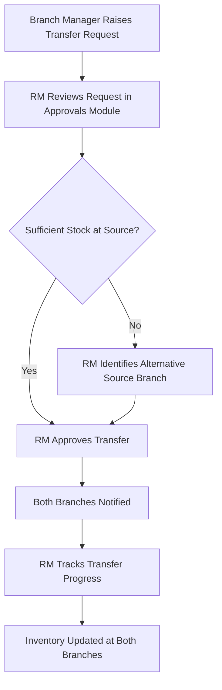
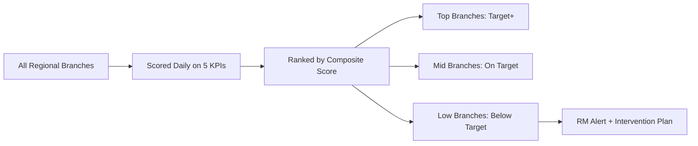
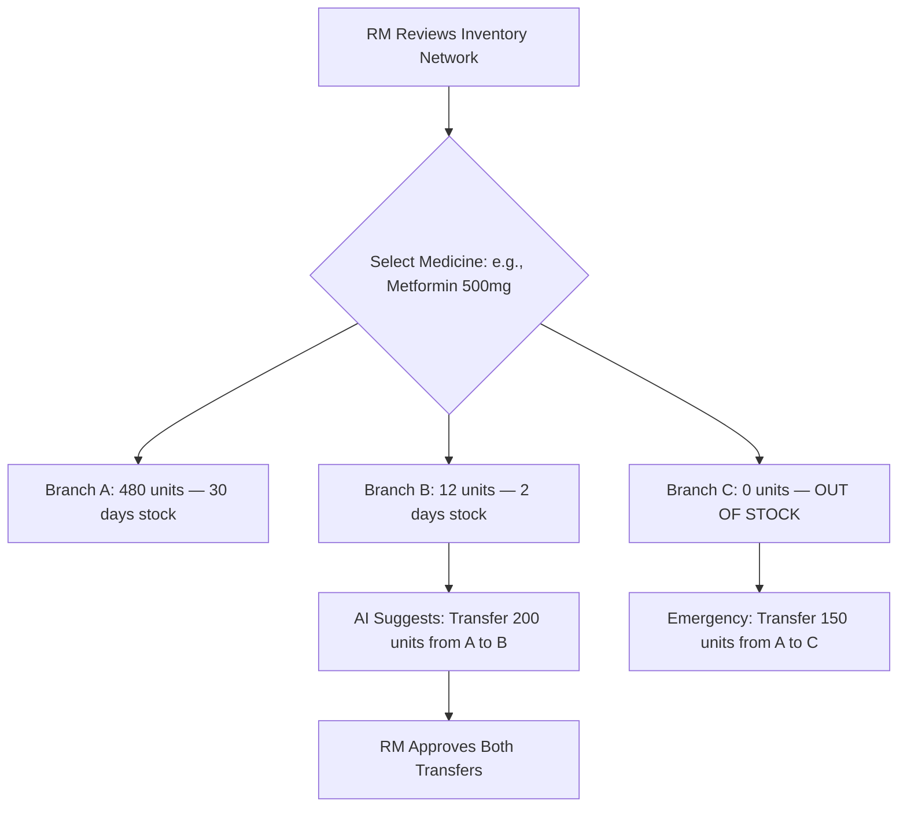
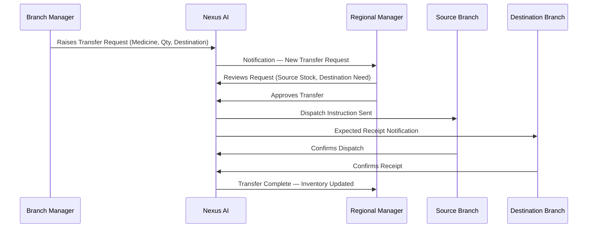

# Nexus AI - Regional Manager Functional Specification
**Enterprise Operating System for Multi-Branch Pharmacy Chains**

---

## 1. Regional Manager Role Overview

The Regional Manager (RM) is the operational and performance oversight authority for all pharmacy branches within a defined geographical region. A region typically comprises 5–20 branches. The RM acts as the bridge between branch-level operations and executive strategy, translating CEO directives into branch-level performance targets while escalating branch-level issues to the CEO.

The RM does not perform cashier, pharmacist, or branch-level daily operations directly. The RM's focus is on coordination, approval, resource balancing, and performance governance across all assigned branches.

### Purpose
To ensure all branches within the region operate efficiently, consistently, profitably, and in full compliance — while optimizing inventory distribution, staffing sufficiency, and customer service across the regional network.

### Core Responsibilities
* Monitor and compare performance metrics across all regional branches.
* Approve inter-branch stock transfer requests.
* Set and track branch-level performance targets.
* Identify and escalate underperforming branches to the CEO.
* Coordinate emergency inventory reallocation during shortages.
* Ensure all branches comply with regulatory and operational standards.
* Support Branch Managers in handling escalations beyond their authority.

### Performance Goals & Operational KPIs

| KPI | Target | Frequency |
| :--- | :--- | :--- |
| **Regional Revenue** | ≥ Monthly Target | Monthly |
| **Regional Stockout Rate** | < 1.5% of active SKUs across region | Weekly |
| **Branch Health Score Average** | ≥ 80/100 across all branches | Weekly |
| **Transfer Fulfillment Rate** | ≥ 97% of approved transfers completed on time | Weekly |
| **Compliance Score** | ≥ 95% across all branches | Monthly |
| **Branch Performance Variance** | < 15% deviation between top and bottom branches | Monthly |
| **Medicine Availability Coverage** | ≥ 98.5% of essential medicines in stock | Daily |

### Responsibility Calendar

#### Daily Responsibilities
* Review overnight alerts: stockouts, branch offline events, compliance anomalies.
* Scan the regional dashboard for branches needing intervention.
* Approve or escalate pending inter-branch transfer requests.
* Monitor AI recommendations for demand spikes and inventory rebalancing.

#### Weekly Responsibilities
* Review branch-by-branch performance comparison report.
* Conduct virtual check-in reviews with underperforming Branch Managers.
* Verify compliance status across all branches.
* Review pending leave escalations from Branch Managers.

#### Monthly Responsibilities
* Approve branch performance target settings for the following month.
* Generate and submit the Regional Summary Report to the CEO.
* Review the medicine availability index across all branches.
* Audit transfer history for anomalies.

#### Quarterly Responsibilities
* Evaluate branch ranking and recommend branch-specific improvement plans.
* Review regional headcount and staffing adequacy.
* Support new branch onboarding within the region.

---

## 2. Regional Operations

### Branch Performance Monitoring
The RM views all branches through a performance matrix. Each branch is scored daily on:
* **Revenue Achievement** (% of daily target met).
* **Stock Availability** (% of active SKUs with sufficient stock).
* **Employee Attendance** (% of scheduled staff present).
* **Customer Satisfaction** (average complaint resolution time).
* **Compliance** (pending audit items, recall acknowledgements).

### Transfer Approval Workflow


### Escalation Handling
The RM is the first escalation point for:
* Cash mismatches above ₹2,000 at EOD.
* Compliance violations flagged by branch audit modules.
* Medicine recalls requiring multi-branch shelf action.
* Staffing shortages affecting pharmacy licensing minimums.

### New Branch Onboarding
The RM coordinates with the CEO and Branch Manager for new branches:
1. Validates initial inventory seeding quantities against regional demand patterns.
2. Configures branch-level performance targets.
3. Assigns the new branch to their regional dashboard view.

---

## 3. Regional Manager Dashboard

The dashboard aggregates real-time data from all branches in the assigned region into a unified command view.

```
+--------------------------------------------------------------------------+
| [ Topbar: Region Name | Date | Search | Alerts | User Profile ]          |
+--------------------------------------------------------------------------+
|  [ Revenue: ₹4.82 Cr ]  [ Profit: ₹1.42 Cr ]  [ Risk Score: 72 ]       |
|  [ Orders: 8,412 ]      [ Compliance: 94% ]    [ Transfers Pending: 7 ] |
+--------------------------------------------------------------------------+
|  [ Branch Comparison Bar Chart ]  |  [ AI Recommendations Panel ]        |
+--------------------------------------------------------------------------+
|  [ Regional Inventory Heatmap ]   |  [ Branch Health Score Grid ]        |
+--------------------------------------------------------------------------+
|  [ Out of Stock Alert List ]      |  [ Pending Approvals List ]          |
+--------------------------------------------------------------------------+
|  [ Regional Attendance Summary ]  |  [ Notifications Feed ]             |
+--------------------------------------------------------------------------+
```

### Dashboard Widgets

| Widget Name | Data Source | Visualization | Purpose |
| :--- | :--- | :--- | :--- |
| **Regional Revenue** | `invoices`, `payments` | KPI Card | Total sales across all regional branches today/this month. |
| **Regional Profit** | `invoices`, `inventory` | KPI Card | Estimated gross margin across all branches. |
| **Regional Orders** | `orders` | KPI Card | Total orders completed across all branches today. |
| **Branch Comparison Chart** | `invoices`, `branches` | Horizontal Bar Chart | Side-by-side revenue comparison of all branches in the region. |
| **Branch Health Scores** | Composite | Score Grid (cards per branch) | Each branch displayed with its composite health score (0–100). |
| **Top Performing Branches** | `view_branch_margin_performance` | Ranked List | Top 3 branches by revenue and health score. |
| **Low Performing Branches** | `view_branch_margin_performance` | Flagged List | Bottom 3 branches below target threshold, flagged for intervention. |
| **Regional Inventory Heatmap** | `inventory`, `branches` | Color-coded Grid | Stock availability per medicine category per branch. |
| **Out of Stock Summary** | `inventory` | Alert Count + List | Total OOS medicines count, grouped by branch. |
| **Pending Transfers** | `stock_transfers` | Counter + Status List | All open transfer requests awaiting RM approval or in transit. |
| **Pending Approvals** | `approvals` | Action List | Refund escalations, staffing exceptions, and budget requests from BMs. |
| **Medicine Availability Index** | `inventory`, `medicines` | Gauge (0–100%) | % of essential medicines in stock across all regional branches. |
| **Regional Customer Growth** | `customers` | Line Chart (30d) | New customer registrations across all regional branches. |
| **Regional Employee Count** | `users`, `user_roles` | KPI Card | Total active staff across all branches in the region. |
| **Regional Attendance** | `employee_shifts` | Gauge | % of scheduled staff present today across all branches. |
| **Regional Alerts Feed** | `notifications` | Priority Feed | All high and critical priority alerts from all regional branches. |
| **AI Recommendations** | `ai_tasks` | Card Panel | Top 5 AI suggestions: transfers, staffing, demand forecasts. |
| **Regional Risk Score** | Composite | Score Ring | Aggregate risk indicator factoring OOS rate, compliance, and attendance. |
| **Compliance Score** | `audit_logs`, `medicine_recalls` | Gauge (0–100%) | % of branches with no open compliance or recall violations. |
| **Transfer Map** | `stock_transfers`, `branches` | Network Flow Diagram | Visual map of active transfer routes between regional branches. |
| **Peak Sales Heatmap** | `orders` | Hour-Day Grid | Shows which day/hour combinations generate highest order volumes regionally. |
| **Dead Stock Summary** | `inventory`, `medicine_batches` | Alert Table | Medicines unsold for 60+ days across all regional branches. |

---

## 4. Permissions (RBAC)

### Can View
* All branch data for branches within the assigned region (inventory, orders, payments, attendance, reports).
* Purchase orders directed to regional branches (read-only delivery status).
* Medicine recall statuses across all regional branches.
* CEO-defined regional targets (read-only).
* AI recommendation outputs.
* Audit logs for all regional branches.

### Can Create
* Inter-branch stock transfer records (manual override if BM hasn't raised one).
* Performance target assignments for branches within the region.
* Regional announcements pushed to all branch BMs.
* Escalation reports submitted to the CEO.

### Can Update
* Branch performance targets.
* Transfer approval notes.
* Regional settings (regional holidays, coverage rules).

### Can Approve / Reject
* Inter-branch stock transfer requests raised by Branch Managers.
* Employee leave escalations beyond BM authority.
* Refund and discount exceptions above BM approval limits.

### Can Delete
* Draft transfer requests created by the RM before submission.

### Cannot Access
* Data from branches in other regions.
* Company-wide financial ledgers (CEO scope).
* Medicine catalog pricing or scheduling configuration.
* User role assignment system.
* Payroll or HR management modules.
* Supplier contract management.

---

## 5. Functional Modules

### A. Regional Dashboard
Consolidated command view for all branches in the region. First screen on login.

### B. Branch Performance Module
Detailed branch-by-branch KPI breakdown, ranking, and target tracking.

### C. Inventory Network Module
Regional inventory visibility with cross-branch stock comparison, transfer recommendations, and rebalancing tools.

### D. Transfers Module
Manage and approve all inter-branch transfer requests; track delivery progress.

### E. Approvals Module
Consolidated list of all escalations from Branch Managers: refunds, leave exceptions, discount overrides.

### F. Employee Overview Module
Regional headcount, attendance trends, staffing shortage flags, and leave escalation management.

### G. Reports Module
Generate, schedule, and download regional reports in PDF, CSV, and Excel formats.

### H. Notifications Module
All regional alerts and announcements, sortable by priority, branch, and category.

### I. Analytics Module
Sales trends, inventory trends, branch ranking, transfer analytics, and regional forecasting.

### J. Compliance Module
Medicine recall status, regulatory audit compliance scores, and narcotics dispensing exception logs per branch.

### K. Medicine Availability Module
Network-wide view of essential medicine coverage across all regional branches.

### L. Regional Settings
Configure regional coverage rules, minimum staffing requirements, and branch target update cycles.

### M. Audit Logs
Chronological read-only log of all actions taken by the RM and all BMs within the region.

---

## 6. Branch Management & Performance

### Branch Ranking & Monitoring



### Performance Target Assignment
* RM assigns monthly revenue targets, stock accuracy targets, and customer satisfaction targets to each branch.
* Targets are set in the Branch Performance module and pushed to the Branch Manager's dashboard.
* Mid-month performance reviews allow the RM to revise targets in case of external factors (e.g., road closures affecting foot traffic).

### Branch Health Score Formula
The composite score is calculated from:
| Component | Weight |
| :--- | :---: |
| Stock Availability (% of SKUs in stock) | 30% |
| Revenue Target Achievement | 30% |
| Employee Attendance Rate | 15% |
| Compliance Score | 15% |
| Customer Complaint Resolution Rate | 10% |

---

## 7. Inventory Network Management

### Regional Inventory Visibility
The RM views aggregated and branch-level stock positions:
* **Available Quantity:** Total units in stock across all branches for any given medicine.
* **Reserved Quantity:** Units committed to pending orders across all branches.
* **In-Transit Quantity:** Units approved for transfer but not yet received.
* **Days of Stock Remaining:** Calculated from current stock and average daily sales velocity.

### Cross-Branch Stock Comparison


### Emergency Inventory Allocation
When a branch is out of stock of a critical medicine (e.g., insulin, cardiac drugs), the RM can override the standard transfer request workflow and push an **Emergency Allocation** directly to the source and destination branches with immediate priority status.

---

## 8. Employee Oversight

### Staffing Visibility
The RM views a staffing summary for each branch:
* Total scheduled employees vs. present today.
* Pharmacist count (critical for regulatory compliance — minimum 1 licensed pharmacist must be on duty).
* Cashier count per active counter.
* Branches where the pharmacist count has dropped below the regulatory minimum are automatically flagged as **Compliance Risk**.

### Leave Escalations
When a Branch Manager cannot find a replacement for an approved leave, the case escalates to the RM:
1. RM receives an alert: "Branch B — No pharmacist coverage for 14:00–20:00 shift."
2. RM contacts the regional relief roster to identify a substitute.
3. RM approves the final assignment, which is recorded in the audit log.

### Performance Trends
* Average orders per cashier per branch.
* Average prescription dispensing time per pharmacist per branch.
* Branch-to-branch staff efficiency comparison.

---

## 9. Sales Oversight

### Regional Sales View
* Total regional revenue (today, this week, this month).
* Contribution percentage of each branch to regional revenue.
* Day-on-day and week-on-week revenue trend per branch.

### Medicine Demand Trends
* **Top 20 Medicines Network-Wide:** Ranked by units sold across all branches.
* **Regional Slow Movers:** Medicines with 30-day sales below 10% of stocked quantity — recommended for rebalancing or markdown.
* **Demand Spikes:** Medicines with >50% uplift in sales velocity in the last 7 days (useful during seasonal health events, e.g., monsoon increases in ORS sales).

### Average Order Value (AOV) Analysis
* Branch-by-branch AOV comparison.
* Decline in AOV over 7 days flags that the branch may have stock gaps on high-value medicines.

---

## 10. Transfer Approval Workflow



### Transfer Status Lifecycle
| Status | Meaning |
| :--- | :--- |
| `PENDING_APPROVAL` | Submitted by BM, awaiting RM review. |
| `APPROVED` | RM has approved; dispatch instruction issued to source branch. |
| `IN_TRANSIT` | Source branch has confirmed dispatch. |
| `RECEIVED` | Destination branch confirmed receipt; inventory updated. |
| `REJECTED` | RM rejected with reason; BM notified. |
| `CANCELLED` | Cancelled by BM before approval. |

---

## 11. AI Integration

### Regional AI Agent
* **Inputs:** Sales velocity per branch, inventory levels, seasonal demand patterns, historical transfer records.
* **Outputs:** Regional stock rebalancing proposals, branch-level demand forecasts, understock risk scores.
* **Confidence:** Displayed as Low / Medium / High per proposal.

### Inventory AI
* **Inputs:** Current stock levels across all branches, inter-branch distances, transfer lead times.
* **Outputs:** Optimal transfer source recommendations (which branch has surplus + fastest delivery time).

### Finance AI
* **Inputs:** Revenue trends, margin data, regional expense records.
* **Outputs:** Revenue forecast accuracy validation, branch cost efficiency rankings.

### Analytics AI
* **Inputs:** Historical orders, customer registrations, peak hours data.
* **Outputs:** Regional sales trend forecasts, customer growth projections.

### Knowledge AI (RAG)
* **Inputs:** Government regulatory updates, CDSCO recall notifications, SOPs.
* **Outputs:** Instant compliance guidance when RM queries ("What are the H1 narcotics reporting requirements for this region?").

### Decision Support Framework
Each AI recommendation shows:
1. **Summary:** What situation was detected.
2. **Data Basis:** Which branches, medicines, and timeframes generated the signal.
3. **Proposed Action:** Specific step (e.g., "Transfer 200 units of Glycomet from Branch A to Branch C").
4. **Confidence Score:** Low / Medium / High with data completeness indicator.
5. **Impact Estimate:** Estimated revenue protected or inventory write-off avoided.

---

## 12. Reports

| Report Name | Frequency | Formats | Key Content |
| :--- | :--- | :--- | :--- |
| **Regional Sales Report** | Daily / Monthly | PDF, Excel | Revenue per branch, comparison vs. targets, AOV. |
| **Regional Inventory Report** | Weekly | PDF, CSV | OOS counts, near-expiry items, dead stock summary. |
| **Branch Performance Report** | Weekly / Monthly | PDF | Health scores, KPI achievement, ranking, trends. |
| **Transfer Activity Report** | Weekly | CSV, PDF | Transfer volumes, approval times, fulfillment rates. |
| **Regional Employee Report** | Monthly | PDF | Headcount, attendance rates, staffing shortages. |
| **Compliance Report** | Monthly | PDF | Audit scores, recall compliance, narcotics exceptions. |
| **Regional Profit Report** | Monthly | PDF, Excel | Gross margins per branch, cost allocations. |
| **Medicine Availability Report** | Weekly / On-Demand | PDF, CSV | Essential medicine coverage by branch. |

---

## 13. Notifications

| Notification Type | Trigger | Priority |
| :--- | :--- | :--- |
| **Critical Stock Shortage** | Any branch reaches OOS on an essential medicine | Critical |
| **Transfer Pending Approval** | New transfer request submitted by a BM | High |
| **Branch Offline** | Branch system has been inactive for > 30 minutes | Critical |
| **Inventory Imbalance Detected** | AI flags a cross-branch surplus vs. shortage opportunity | Medium |
| **Compliance Issue Flagged** | Prescription exception or recall non-compliance at a branch | High |
| **Regional Announcement** | RM broadcasts a message to all Branch Managers | Low |
| **AI Recommendation Available** | New high-confidence inventory or staffing suggestion | Low |
| **Emergency Allocation Needed** | Two or more branches simultaneously OOS on same medicine | Critical |
| **Pharmacist Coverage Risk** | Branch pharmacist count drops below regulatory minimum | Critical |

---

## 14. Search

| Search Category | Searchable Fields |
| :--- | :--- |
| **Branches** | Branch name, city, branch code, health score, status |
| **Medicines** | Brand name, generic name, SKU code, schedule classification |
| **Transfers** | Transfer ID, status, source/destination branch, medicine name |
| **Employees** | Name, employee ID, role, assigned branch |
| **Orders** | Order number, branch, date, status (for escalation review) |
| **Reports** | Report type, date, branch |
| **Customers** | Name, phone number — read-only summary count per branch |

---

## 15. Analytics

### Regional Sales Trends
* Day-over-day and month-over-month revenue per branch.
* Regional contribution analysis: which branches drive the most revenue.

### Branch Performance Trends
* Rolling 30-day health score per branch.
* Branches improving vs. declining on each individual KPI component.

### Inventory Trends
* Stock availability rate over trailing 30 days per branch.
* Transfer velocity: how quickly approved transfers are fulfilled.

### Transfer Analytics
* Average time from transfer request submission to RM approval.
* Average time from approval to destination receipt.
* Most frequently transferred medicines (potential supply chain problem indicator).

### Medicine Demand Analytics
* Demand vs. supply gap visualization for top 50 essential medicines.
* Seasonal demand pattern heatmap.

### Regional Forecasts
* 7-day revenue forecast per branch (based on historical patterns + AI model).
* Expected stockout risk list: medicines likely to hit OOS within 7 days given current sales velocity.

---

## 16. Security & Access Control

* **Authentication:** SSO with mandatory MFA. RM session requires re-authentication after 45 minutes of inactivity.
* **Regional Data Isolation:** All data queries are automatically scoped to the RM's assigned `region_id`. Cross-region data access is strictly blocked at the database (RLS) level.
* **Authorization:** RBAC enforces that the RM cannot access CEO financial tools, company-wide ledgers, or other regions' dashboards.
* **Audit Logs:** Every transfer approval, escalation, target update, and report export is logged with user ID, timestamp, IP address, and action detail. Logs are append-only and tamper-resistant.

---

## 17. API Specifications

### GET `/api/regions/{region_id}/dashboard`
* **Purpose:** Returns all KPI widget data for the RM's regional dashboard.
* **Response (200 OK):**
```json
{
  "region_id": "r1111...",
  "regional_revenue": 48200000.00,
  "regional_orders": 8412,
  "branch_count": 12,
  "oos_medicine_count": 7,
  "pending_transfers": 5,
  "compliance_score": 94.2,
  "medicine_availability_index": 97.8,
  "regional_risk_score": 72
}
```

### GET `/api/regions/{region_id}/branches/performance`
* **Purpose:** Returns branch-by-branch performance metrics and health scores.
* **Response (200 OK):**
```json
[
  {
    "branch_id": "b1111...",
    "branch_name": "Banjara Hills",
    "health_score": 91,
    "revenue_today": 84200.00,
    "target_revenue": 80000.00,
    "stock_availability": 98.4,
    "attendance_rate": 100.0,
    "compliance_score": 96.0
  }
]
```

### GET `/api/regions/{region_id}/inventory/network`
* **Purpose:** Returns stock positions for a specific medicine across all regional branches.
* **Query Params:** `?medicine_id=m1111...`
* **Response (200 OK):**
```json
[
  {
    "branch_id": "b1111...",
    "branch_name": "Banjara Hills",
    "quantity": 480,
    "days_of_stock": 32,
    "status": "HEALTHY"
  },
  {
    "branch_id": "b2222...",
    "branch_name": "Jubilee Hills",
    "quantity": 8,
    "days_of_stock": 1,
    "status": "CRITICAL"
  }
]
```

### POST `/api/regions/{region_id}/transfers/{transfer_id}/approve`
* **Purpose:** Approves a pending transfer request.
* **Request Body:**
```json
{ "action": "APPROVE", "note": "Confirmed surplus at source branch." }
```
* **Response (200 OK):**
```json
{
  "transfer_id": "t9999...",
  "status": "APPROVED",
  "approved_by": "rm_user_id",
  "approved_at": "2026-07-06T16:14:04Z"
}
```

### GET `/api/regions/{region_id}/reports/performance`
* **Purpose:** Returns the compiled monthly branch performance report.
* **Query Params:** `?month=2026-07`
* **Response (200 OK):**
```json
{
  "period": "2026-07",
  "region_id": "r1111...",
  "branches": [
    {
      "branch_id": "b1111...",
      "revenue": 2600000.00,
      "target": 2400000.00,
      "achievement_pct": 108.3,
      "health_score_avg": 88.4
    }
  ]
}
```

---

## 18. Database Tables Accessed

| Table Name | Read | Write | Update | Delete |
| :--- | :---: | :---: | :---: | :---: |
| `regions` | ✅ | ❌ | ✅ | ❌ |
| `branches` | ✅ | ❌ | ❌ | ❌ |
| `inventory` | ✅ | ❌ | ❌ | ❌ |
| `medicine_batches` | ✅ | ❌ | ❌ | ❌ |
| `medicines` | ✅ | ❌ | ❌ | ❌ |
| `orders` | ✅ | ❌ | ❌ | ❌ |
| `invoices` | ✅ | ❌ | ❌ | ❌ |
| `payments` | ✅ | ❌ | ❌ | ❌ |
| `customers` | ✅ | ❌ | ❌ | ❌ |
| `stock_transfers` | ✅ | ✅ | ✅ | ✅ |
| `transfer_items` | ✅ | ✅ | ❌ | ❌ |
| `approvals` | ✅ | ❌ | ✅ | ❌ |
| `users` | ✅ | ❌ | ❌ | ❌ |
| `user_roles` | ✅ | ❌ | ❌ | ❌ |
| `employee_shifts` | ✅ | ❌ | ❌ | ❌ |
| `branch_targets` | ✅ | ✅ | ✅ | ❌ |
| `medicine_recalls` | ✅ | ❌ | ✅ | ❌ |
| `purchase_orders` | ✅ | ❌ | ❌ | ❌ |
| `notifications` | ✅ | ✅ | ✅ | ❌ |
| `audit_logs` | ✅ | ❌ | ❌ | ❌ |
| `ai_tasks` | ✅ | ❌ | ❌ | ❌ |

---

## 19. UI / UX Specifications

### Navigation & Sidebar
* **Sidebar Sections:** Regional Dashboard, Branches, Inventory Network, Transfers, Approvals, Employees, Analytics, Reports, Compliance, Notifications, Audit Logs, Settings.
* The sidebar is collapsible. Region name and current alert count are always visible.

### Topbar
* **Region Badge:** Always shows the assigned region name.
* **Alert Bell:** Unread notification count with dropdown preview of top 5 alerts.
* **Global Search:** Searches across all in-region data in real time.
* **User Profile:** Name, role, region, and logout.

### Dashboard Layout
* **Row 1:** 4 KPI Cards (Regional Revenue, Orders, Compliance Score, Risk Score).
* **Row 2:** Branch Comparison Bar Chart (left) | AI Recommendations Panel (right).
* **Row 3:** Regional Inventory Heatmap (full width).
* **Row 4:** Branch Health Score Grid (left) | Pending Transfers + Approvals (right).
* **Row 5:** Regional Alerts Feed (full width).

### Maps & Geographic Views
* The Transfer Map widget uses a node-network diagram showing branches as nodes and active transfers as directional arrows with quantity labels.
* Optional: Regional sales heatmap overlaid on a simple India state/city map.

### Design System
* **Dark Mode:** Default dark theme (slate/zinc base). Green accents for healthy status, amber for warning, red for critical.
* **Responsive:** Full functionality on desktop (1440px+) and 12-inch tablets in landscape mode.
* **Accessibility:** WCAG 2.1 AA. All status indicators use both color and icon/text label.

---

## 20. Real-World Pharmacy Use Cases

### Scenario 1: Branch Stock Shortage — Cross-Branch Transfer
* **Situation:** Banjara Hills branch has 0 units of Glycomet 500mg (antidiabetic — critical medicine). 120 patients waiting.
* **RM Action:** RM views the inventory network widget, identifies Jubilee Hills branch has 800 units (32 days of stock). RM immediately approves an emergency transfer of 200 units from Jubilee Hills. The RM monitors the in-transit status and notifies the BM at Banjara Hills of the expected delivery time.

### Scenario 2: Branch Underperformance
* **Situation:** Secunderabad branch has been achieving only 60% of its monthly revenue target for three consecutive weeks.
* **RM Action:** RM opens the branch performance module and reviews the detailed KPI breakdown. Identifies the branch has a 14% stockout rate on high-demand generic medicines. RM raises a stock rebalancing request from three neighboring branches and schedules a virtual review meeting with the Secunderabad BM.

### Scenario 3: Medicine Recall Across Region
* **Situation:** CDSCO issues a recall on batch B20261001 of Metformin 500mg (contamination risk).
* **RM Action:** The RM receives a Critical recall alert. Opens the Compliance module to see which branches have this batch in stock (4 out of 12 branches). RM confirms all four branches have acknowledged and quarantined the batch within 2 hours. Generates a recall compliance report and submits it to the CEO.

### Scenario 4: Festival Demand Spike
* **Situation:** AI agent detects a 67% surge in demand for analgesics and ORS sachets across 8 regional branches during a regional heatwave.
* **RM Action:** RM reviews the AI recommendation: "Reorder Request Recommended for Electral 1L and Crocin 650mg across 8 branches." RM escalates recommended purchase orders to the CEO for procurement approval, and simultaneously approves inter-branch balancing transfers from the 4 branches that still have adequate stock.

### Scenario 5: New Branch Onboarding
* **Situation:** A new branch is opening in Kondapur next month.
* **RM Action:** RM uses the Regional Settings module to add the new branch to the region. Uses the Analytics module to analyze Kondapur-area demand patterns and sets the initial inventory seed list (top 300 SKUs). Assigns a monthly revenue target and confirms the staffing roster minimum requirement.

### Scenario 6: Regional Pharmacist Shortage
* **Situation:** A gastroenteritis outbreak causes 4 pharmacists across 3 branches to call in sick on the same day.
* **RM Action:** RM receives a Critical compliance alert: "3 branches below regulatory minimum pharmacist count." Reviews the regional relief roster and coordinates redistribution so each branch has at least one licensed pharmacist. Logs all shifts in the audit trail for regulatory inspection.

### Scenario 7: Emergency Inventory Allocation
* **Situation:** A flood cuts off supply routes to 3 western branches for 5 days.
* **RM Action:** RM activates Emergency Allocation mode. Identifies which branches have 15+ day surplus of essential medicines. Creates bulk transfer approvals for all 25 critical SKUs. Notifies the CEO of the supply chain risk and expected recovery date.

### Scenario 8: Inventory Imbalance — Dead Stock
* **Situation:** AI flags that Branch D has 500 units of Rabeprazole 20mg (90-day supply) while Branches C and E have less than 5-day supply of the same.
* **RM Action:** RM approves a split rebalancing transfer: 150 units to Branch C, 150 units to Branch E. Remaining 200 units at Branch D are adequate, avoiding a write-off of the excess stock.

---

## 21. Demo Walkthrough (Hackathon Demonstration)

```
[Login Page]
     ↓
Enter: regional.manager@nexuscare.com
     ↓
[Regional Dashboard]
     ↓
Review: 3 Pending Transfer Requests | 2 Compliance Alerts | AI Recommendation
     ↓
Navigate: Inventory Network → Search: "Glycomet 500mg"
     ↓
Observe: Banjara Hills = 0 units | Jubilee Hills = 800 units
     ↓
Navigate: Transfers → Review Pending Request from Banjara Hills BM
     ↓
Click "Approve Transfer" → Status changes to APPROVED
     ↓
Navigate: Dashboard → Transfer counter decrements from 3 to 2
     ↓
Navigate: Analytics → Review Monthly Branch Comparison Chart
     ↓
Navigate: Reports → Generate "Regional Sales Report" → Download PDF
     ↓
Navigate: Audit Logs → Confirm transfer approval is logged with timestamp
     ↓
[Logout]
```

**Narration Points:**
1. Login loads the multi-branch regional view instantly — scoped to only the RM's assigned region.
2. The transfer approval is a 3-click workflow: Review → Approve → Confirm.
3. The regional inventory network shows cross-branch stock at a glance, enabling data-driven transfer decisions.
4. The monthly branch performance report provides an executive-quality document in under 10 seconds.
5. Every action is logged with a timestamp, demonstrating audit-readiness for regulatory inspection.

---

## 22. Acceptance Criteria

| Feature | Success Criteria |
| :--- | :--- |
| **Dashboard Load Time** | All widgets render in under 2 seconds for regions with up to 20 branches. |
| **Transfer Approval** | Approval action updates transfer status in both branches within 3 seconds. |
| **Branch Health Score** | Score recalculated and displayed within 5 minutes of any source data change. |
| **Regional Data Isolation** | RM cannot view, filter, or export any data from branches outside their region. |
| **Compliance Alert** | Recall non-compliance at any branch triggers a Critical alert within 5 minutes. |
| **Report Generation** | Any Regional report generates and is ready to download within 15 seconds. |
| **Inventory Network Refresh** | Cross-branch stock positions reflect actual inventory within 2 minutes of a POS update. |
| **Emergency Allocation** | Emergency transfer override bypasses BM approval step and is processed in under 30 seconds. |
| **AI Recommendations** | High-confidence recommendations are surfaced within 10 minutes of triggering inventory conditions. |

---

## 23. Edge Cases

| Scenario | System Behavior |
| :--- | :--- |
| **Transfer Rejected** | BM notified with RM's rejection reason. Transfer status set to `REJECTED`. BM can amend and resubmit. |
| **No Regional Branch Has Stock** | Inventory network shows "No stock available in region." System escalates to CEO for inter-region transfer or procurement override. |
| **Branch System Offline** | Branch marked as OFFLINE in the dashboard. RM alerted. Data from last known state is shown with a stale-data indicator. |
| **Regional Network Outage** | RM dashboard shows cached last-known data. A banner warns data may be up to 30 minutes old. Approval actions are queued and replayed on reconnection. |
| **Duplicate Transfer Request** | If a BM raises a transfer for a medicine already approved today, the system warns "An active transfer for this medicine exists" and blocks duplicate submission. |
| **Medicine Recall During Active Orders** | All active orders containing the recalled batch are placed on `HOLD`. BM is alerted. RM receives a compliance notification with list of affected orders. |
| **Inventory Mismatch Post-Transfer** | If destination branch's confirmed receipt quantity differs from dispatched quantity, the system flags a discrepancy audit case and notifies the RM for manual resolution. |
| **AI Agent Unavailable** | The AI Recommendations panel shows "AI service temporarily unavailable." All manual workflows remain fully operational. No data is lost. |

---

## 24. Production Readiness Checklist

- [ ] Regional data isolation (RLS) verified — RM cannot access data outside their region under any query pattern.
- [ ] Transfer approval workflow tested end-to-end across branches with conflicting inventories.
- [ ] Emergency allocation override tested with simultaneous multi-branch shortages.
- [ ] Branch health score computation validated against known test data sets.
- [ ] All 9 notification types verified with correct priority levels and delivery channels.
- [ ] Compliance recall module tested: batch quarantine blocks POS sales and triggers RM alert within 5 minutes.
- [ ] Report generation load-tested for regions with 20 branches.
- [ ] Stale data indicators tested for offline branch scenarios.
- [ ] AI recommendation fallback validated for agent outage scenarios.
- [ ] Audit log completeness confirmed — all RM actions (approvals, target updates, escalations) are captured.
- [ ] Transfer map visualization tested with 10+ simultaneous active transfers.
- [ ] Dark mode verified across all 13 modules.
- [ ] Responsive layout tested on 12-inch tablet in landscape orientation.
