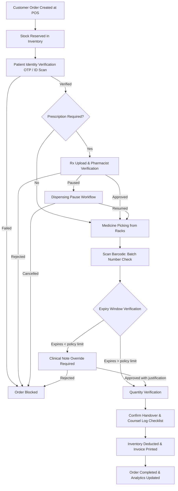
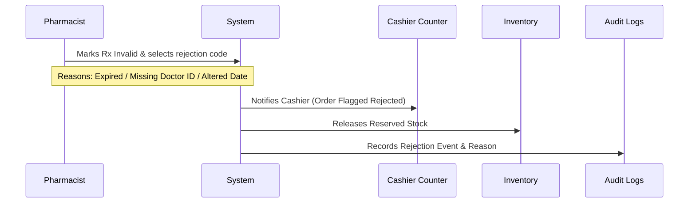

# Nexus AI - Pharmacist Functional Specification
**Enterprise Operating System for Multi-Branch Pharmacy Chains**

---

## 1. Pharmacist Role Overview

The Pharmacist is a licensed healthcare professional responsible for the safe, legal, and clinically accurate dispensing of medications within a single pharmacy branch. The pharmacist reviews prescription integrity, validates dosages, detects drug-drug interactions, coordinates clinical exclusions, and counsels patients on medicine usage.

The Pharmacist works strictly inside the branch. The role is focused on clinical validation and dispensing safety, completely isolated from administrative store management (Branch Manager), regional logistics (Regional Manager), and POS checkout/billing execution (Cashier).

### Purpose
To guarantee medication dispensing safety, clinical accuracy, and full regulatory compliance with CDSCO, Drugs & Cosmetics Act, and Schedule H/H1/X regulations.

### Core Responsibilities
* Verify that digital and physical prescriptions are authentic and currently valid.
* Pick, match, and verify medicine names, batch numbers, and expiry dates.
* Perform clinical safety checks: drug interactions, contraindications, and allergy flags.
* Record dispensing events immutably in compliance logs.
* Counsel customers on dosage, storage guidelines, and possible side effects.
* Approve clinically appropriate generic substitutions when prescribed brands are unavailable.
* Monitor cold chain compliance and quarantine recalled medicines immediately.

### Performance Goals & Operational KPIs

| KPI | Target | Measurement Frequency |
| :--- | :--- | :--- |
| **Dispensing Accuracy** | 100% (Zero dispensing errors) | Daily |
| **Prescription Verification Time** | < 3 minutes per prescription | Hourly |
| **Controlled Drug Log Accuracy** | 100% mismatch-free | Daily |
| **Allergy & Interaction Check Compliance** | 100% of orders checked | Daily |
| **Average Customer Counseling Time** | 1.5 to 3 minutes | Hourly |
| **Generic Substitution Rate** | ≥ 15% of out-of-stock brand prescriptions | Monthly |
| **Cold Chain Compliance** | 100% telemetry resolution compliance | Daily |

### Schedule of Operations

#### Daily Responsibilities
* **Morning Roster Check:** Verify POS login and sync status. Review the pending dispensing queue.
* **Controlled Substances Handover:** Physically count and sign off on target Schedule X and narcotics stock counts inside the double-locked cabinet.
* **Verification Queue Processing:** Continually inspect, approve, or reject active prescriptions.
* **EOD Dispensing Audit:** Match physical prescription documents received today against digital orders. Sign off on the daily dispensing registry.
* **Telemetry Review:** Verify refrigerator health logs for vaccine/insulin boxes.

#### Weekly Responsibilities
* **Near-Expiry Audits:** Scan cold storage and fast-moving racks for batches expiring within 90 days. Flag them for reallocation or markdown.
* **Quarantine Management:** Move recalled or physically compromised batches to the branch quarantine area and log changes.

#### Monthly Responsibilities
* **Controlled Substances Ledger Review:** Reconcile monthly sales of Scheduled drugs against CDSCO form files.
* **Audit Trail Verification:** Review override audit logs where pharmacist overrides safety flags.

---

## 2. Medicine Dispensing Workflow



1. **Order Creation:** Cashier enters items in POS, creating a pending order.
2. **Reservation:** Inventory reserves the items, changing status from `AVAILABLE` to `RESERVED`.
3. **Patient ID Verification:** For Controlled/Scheduled drugs, pharmacist validates recipient ID.
4. **Rx Verification:** For Schedule H/H1/X medicines, pharmacist validates uploaded prescription. Can trigger a pause if doctor confirmation is needed.
5. **Picking:** Pharmacist retrieves items using exact rack coordinates.
6. **Batch/Expiry Check:** Scan GS1 barcode to match batch and verify shelf life. If close to expiry, requires override justification notes.
7. **Quantity Matching:** Verify pack size and pill quantity counts.
8. **Handover & Counsel checklist:** Perform counseling walkthrough and collect digital checklist marks.
9. **Final Inventory Deduction:** Deducts stock, generates compliance audit file, prints cashier receipt.

---

## 3. Pharmacist Dashboard

The pharmacist dashboard focus is strictly on order verification, dispensing backlog, clinical alerts, and shelf telemetry.

```
+--------------------------------------------------------------------------+
| [ Topbar: Branch | Dispensing Status Indicator | Notifications | Profile ]|
+--------------------------------------------------------------------------+
|  [ Daily Dispensed: 142 ]  [ Avg Dispense Time: 2.1m ]  [ Pending Rx: 4 ]|
|  [ Cold Storage: 4.2°C ]   [ Recall Notices: 2 Act ]    [ Paused Orders: 3 ]|
+--------------------------------------------------------------------------+
|  [ Pending Dispensing Queue ]       |  [ Prescription View Component ]   |
|  List of active order requests     |  - Image / Patient Details        |
|  Status: Draft / Paused / Verified |  - Doctor validation portal       |
+--------------------------------------------------------------------------+
|  [ Medicine Stock Availability ]    |  [ Patient Safety Alerts ]        |
|  Fast SKU lookup & batch expiry    |  - Interaction Warnings           |
|                                     |  - Patient verification details   |
+--------------------------------------------------------------------------+
|  [ AI Recommendations & Guidance ]  | [ Cold Chain Telemetry Monitor ]   |
|  Generic replacements & dose checks | Real-time fridge status line graph  |
+--------------------------------------------------------------------------+
```

### Dashboard Widgets

* **Pending Dispensing Queue:** List of orders waiting for pharmacist verification and medicine picking. Shows if order status is `DRAFT` or `PAUSED`.
* **Prescription Queue:** Filtered list of orders containing prescription-only drugs. Select a row to load the medicine details.
* **Cold Box Telemetry:** Real-time stream chart showing temperature (2–8°C threshold limits) with status indicator: `SAFE`, `WARNING`, `CRITICAL`.
* **Recall Quarantine Workspace:** Alerts panel showing active batch recalls. Allows pharmacist to register scanned boxes directly to quarantined inventory.
* **Patient Identity Verification Panel:** OTP trigger portal and government photo ID capture form for Schedule H1/X narcotic pickups.
* **Paused Sessions Portal:** List of active paused orders, displaying elapsed pause duration, pause reason (e.g., `WAITING_DR_CONFIRM`), and resume button.
* **Expiry Alerts Ring:** Red/amber status ring displaying count of branch batches expiring within 90 days.
* **Patient & Doctors Detail Card:** Displays patient notes, allergic flags, and doctor license credentials for active orders.
* **AI Generic Substitution Suggester:** High-confidence generic suggestions when the prescribed brand is out of stock.
* **Notifications Feed:** Real-time push notifications for urgent medicine recalls or new high-priority queue items.

---

## 4. Permissions (RBAC Matrix)

| Entity Name | Read | Create | Update | Delete | Approve / Reject |
| :--- | :---: | :---: | :---: | :---: | :---: |
| **Pending Orders** | Included | Excluded | Excluded | Excluded | Included (Rx Approval) |
| **Inventory Stock Levels** | Included | Excluded | Excluded | Excluded | Excluded |
| **Medicine Batches** | Included | Excluded | Included (Quarantine) | Excluded | Excluded |
| **Prescriptions Files** | Included | Included | Included | Excluded | Included |
| **Customer Medical Profiles** | Included | Included | Included | Excluded | Excluded |
| **Generic Substitutions** | Included | Excluded | Excluded | Excluded | Included |
| **Incident Reports / Discrepancies**| Included | Included | Included | Excluded | Excluded |
| **Reports (Dispensing Logs)** | Included | Included | Excluded | Excluded | Excluded |
| **Cold Storage Telemetry** | Included | Excluded | Included (Reconciliation) | Excluded | Excluded |
| **Clinical Notes & Overrides** | Included | Included | Excluded | Excluded | Included (Clinical Notes) |

---

## 5. Functional Modules

### A. Dispensing Queue (with Paused State support)
Centralized queue of draft POS orders. Displays order age, customer name, and number of items. Paused orders remain pinned with green resume flags.

### B. Prescription Verification Portal
Interactive split-screen interface showing the digital prescription image on the left and order items on the right. Validate physician registration ID and expiration date.

### C. Clinical Note Override Panel
Provides text capture modal to log clinical notes, doctor confirmations, and explanations for safety warnings or near-expiry batches.

### D. Cold Storage Telemetry Dashboard
Continuous monitoring view displaying temperature and humidity sensors log. Out of range thresholds trigger alarms.

### E. Batch Recall Quarantine System
Dedicated portal to search CDSCO or manufacturer recall notices, pick affected batch numbers, scan boxes to move stock, and isolate items from retail POS.

### F. Patient Verification Hub
Enables sending and confirming customer OTP verification codes, and scanning recipient ID cards for controlled substance records.

---

## 6. Prescription Management

### Prescription Validation Rules
Every prescription must undergo verification across these five elements:
1. **Physician Credentials:** Registry lookup verified via state medical council guidelines.
2. **Aged Check:** Maximum of 6 months from date of issue for standard drugs, 30 days for Schedule H, and 7 days for Schedule X.
3. **Dosage Integrity:** Validation of frequency and duration boundaries.
4. **Controlled Substance Compliance:** Schedule H1/X orders require patient phone number, doctor ID, and matching prescription scan.
5. **Relevance Match:** Medicine name matches the scanned image exactly or fits generic substitution rules.

### Prescription Rejection Flow


---

## 7. Medicine Dispensing Details

### Pick and Scan Verification
* **Step 1 (Shelf Pick):** System shows exact rack coordinate (e.g., A5-Rack 2). Pharmacist retrieves physical box.
* **Step 2 (Scan Match):** Scans product GS1 barcode.
* **Step 3 (Batch Validation):** Barcode validation confirms picked batch number matches reserved batch in database.
* **Step 4 (Expiry Policy Check):** If batch expiry date is less than configured minimum shelf-life policy (e.g., 60 days), the checkout blocks and prompts for a manual clinical justification note or a batch swap.

### Handover Protocol
* Execute customer identity verification (OTP check or photobank ID scan).
* Display and verify counseling checklist.
* Print dosage instruction labels and finalize checkout.

---

## 8. Patient Safety & Clinical Decision Support

### Near-Expiry Shelf-Life Policies
The branch enforces minimum shelf-life limits per medicine category before allocation is allowed:
* **Standard Category:** Minimum 60 days remaining shelf life.
* **Pediatric Liquids:** Minimum 90 days remaining shelf life.
* **Chronic Care Categories (Insulin, Cardiovascular):** Minimum 120 days remaining shelf life.
* Scans violating these rules prompt a blocking modal requiring the pharmacist to input a clinical note justification (e.g., "Short course of 5 days, patient counselled and agreed").

### Automated Contraindication Engine
* **Drug-Drug Interactions:** Flags dangerous combinations (e.g., Sildenafil + Nitroglycerin).
* **Allergy Check:** Compares customer profile allergy list against chemical components.
* **Duplicate Therapy:** Flags duplicate drug categories in current order (e.g., prescribing two similar NSAIDs).
* **Pregnancy Alerts:** Blocks Category X drugs for pregnant patients.
* **Age Restrictions:** Warns or blocks pediatric usage for adult-formulated pills.

---

## 9. Customer Interaction & Counselling

The counseling checklist is digitally checked off before final release:
* **Dosage & Frequency:** [ ] Checked duration instructions (e.g., take 1 before sleep).
* **Storage Instructions:** [ ] Checked if cold chain maintenance is required.
* **Missed Dose Action:** [ ] Confirmed guidance in case of missed intake.
* **Side Effect Awareness:** [ ] Notified about drowsiness, nausea, or dizziness risks.
* **Digital counseling sign-off:** Logged digital acknowledgment matching transaction records.

---

## 10. AI Integration

* **Inventory AI:**
  * *Inputs:* Active stock status, local weather warnings, regional disease spikes.
  * *Outputs:* Inbound transfer suggestions for high-demand molecules before shortages occur.
* **Prescription AI (OCR Parse):**
  * *Inputs:* Handwritten or digital prescription scans.
  * *Outputs:* Suggested list of molecules, dosages, and doctor license matches.
  * *Confidence:* Confidence score (0–100%). Low confidence (<85%) requires manual input.
* **Clinical Decision Support:**
  * AI suggests equivalent alternatives when a prescribed medicine is out of stock.

---

## 11. Reports

* **Daily Dispensing Log:** Details all scripts cleared with active pharmacist signature.
* **H1 Compliance Registry:** Formats and prints Schedule H1 book containing details of buyer name, doctor, and molecules.
* **Near Expiry Log:** List of batches within 90 days.
* **Safety Override Logs:** Audit log of safety interaction warnings bypassed by the pharmacist (including notes).
* **Cold Storage Log:** 30-day historical log of temperatures, sensor outages, and temperature excursion exceptions.
* **Recall Quarantine Log:** Details of quarantined medicines, batch numbers, total vials segregated, and disposal reference.

---

## 12. Notifications

* **New Dispensing Request:** Pushes audio-visual ping on dashboard when cashier submits order.
* **Medicine Recall:** Immediate full-screen alert blocking recalled batch barcode scans.
* **Cold Storage Break:** Alert triggered when refrigerator temperature leaves the 2–8°C range.
* **Low Stock Alarm:** Triggers when essential emergency molecules drop below safety limits.
* **Temperature Sensor Error:** High priority alert when thermocouple loses heartbeat for >10 mins.

---

## 13. Global Search

Index scope covers:
* **Medicines:** Generic name, brand, chemical type, schedule, available batch list.
* **Customers:** Medical history, phone number, old prescriptions.
* **Dispensing History:** Past verified orders filtering by pharmacist id or date.
* **Quarantined Batches:** List of all isolated inventories by recall reference.

---

## 14. Analytics

### Performance Metrics
* Active dispensing queue length trends.
* Average time taken to review, pick, scan, and dispense.
* Prescription approval vs. rejection ratio.
* Percentage of generic substitutions recommended and implemented.

---

## 15. Security & Access Control

* **MFA Verification:** Required for credentials validation on login.
* **Row-Level Security (RLS):** REST API calls enforce branch limits.
* **Audit Trails:** All dispense operations, overrides, and cancellations are saved with timestamps.
* **Controlled Substance Tracking:** Schedule X dispenses require dual-signature (BM + Pharmacist) credentials for checkout validation.

---

## 16. API Specifications

### GET `/api/pharmacist/queue`
* **Purpose:** Returns list of pending orders ready for dispensing validation.
* **Response (200 OK):**
```json
[
  {
    "order_id": "o1111111...",
    "order_no": "ORD-2026-8812",
    "status": "PENDING_DISPENSING",
    "items_count": 3,
    "has_prescription": true,
    "created_at": "2026-07-06T16:20:00Z"
  }
]
```

### POST `/api/pharmacist/dispense`
* **Purpose:** Validates scans, logs signatures, checks counseling checklists, and updates inventory.
* **Request Body:**
```json
{
  "order_id": "o1111111...",
  "pharmacist_signature": "d2222222...",
  "items": [
    { "medicine_id": "m1111...", "batch_no": "B20261101", "quantity": 10 }
  ],
  "counseling_confirmed": {
    "dosage_explained": true,
    "storage_explained": true,
    "warnings_explained": true
  }
}
```
* **Response (200 OK):**
```json
{ "status": "DISPENSED", "invoice_id": "i3333333..." }
```

### POST `/api/pharmacist/dispense/{order_id}/pause`
* **Purpose:** Pauses active checkout session, moving status to `PAUSED` and caching active inventory lock.
* **Request Body:**
```json
{ "pause_reason": "WAITING_DR_CONFIRM" }
```
* **Response (200 OK):**
```json
{ "order_id": "o1111...", "status": "PAUSED", "paused_at": "2026-07-06T16:41:48Z" }
```

### POST `/api/pharmacist/dispense/{order_id}/resume`
* **Purpose:** Resumes a paused checkouts queue card transaction.
* **Response (200 OK):**
```json
{ "order_id": "o1111...", "status": "ACTIVE" }
```

### GET `/api/pharmacist/cold-chain/status`
* **Purpose:** Returns current temperature telemetry status.
* **Response (200 OK):**
```json
{
  "box_id": "box_9921",
  "temperature": 4.2,
  "status": "HEALTHY",
  "last_updated": "2026-07-06T16:40:00Z"
}
```

### POST `/api/pharmacist/recalls/{recall_id}/quarantine`
* **Purpose:** Isolates recalled medicine items and changes status inside DB.
* **Request Body:**
```json
{ "batch_no": "B202611", "units_quarantined": 45 }
```
* **Response (200 OK):**
```json
{ "quarantine_id": "q1101...", "status": "QUARANTINED" }
```

---

## 17. Database Tables Accessed

### `cold_chain_telemetry`
* **Schema:** (`id` uuid, `branch_id` uuid, `box_name` varchar, `temperature` numeric, `humidity` numeric, `timestamp` timestamp, `status` varchar)

### `recall_quarantine_logs`
* **Schema:** (`id` uuid, `recall_id` uuid, `branch_id` uuid, `batch_no` varchar, `units_quarantined` int, `quarantined_by` uuid, `timestamp` timestamp)

### `dispensing_sessions`
* **Schema:** (`id` uuid, `order_id` uuid, `pharmacist_id` uuid, `state` varchar, `pause_reason` varchar, `paused_at` timestamp, `resumed_at` timestamp)

### `clinical_overrides`
* **Schema:** (`id` uuid, `order_id` uuid, `pharmacist_id` uuid, `override_type` varchar, `override_note` text, `timestamp` timestamp)

### `counseling_logs`
* **Schema:** (`id` uuid, `order_id` uuid, `pharmacist_id` uuid, `dosage_explained` bool, `storage_explained` bool, `warnings_explained` bool, `timestamp` timestamp)

---

## 18. UI / UX Design

### Telmetry Display View
* Single line chart monitoring cold storage environment temperature points. Warnings overlay color shifts to yellow (temp > 8°C) or flashing red (temp > 10°C).

### Dispensing Screen (Pause Support)
* Active column displays order cards split-pane. A prominent "Pause Dispense" button floats on the right of prescription view cards. Paused orders display as gray tiles in column queue.

---

## 19. Real-World Pharmacy Use Cases

### Scenario 1: Temperature Excursion Incident
* **Situation:** Refrigerator temperature rises to 9.5°C during hot season.
* **Pharmacist Action:** Dashboard emits warning tone. Pharmacist opens "Cold Chain Widget", identifies critical reading. Verifies problem (door was left ajar), closes it. Moves sensitive assets to auxiliary cooler cabinet, then reconciles the incident by logging explanation and resolving event status.

### Scenario 2: Paused Order Processing
* **Situation:** Customer comes to retrieve a prescribed sedative. The pharmacist notices the daily dose limits are exceeded.
* **Pharmacist Action:** Pharmacist hits "Pause Dispense", selecting reason as `WAITING_DR_CONFIRM`. The session caches and free locks the cashier drawer. Pharmacist calls doctor to clarify. After 15 minutes, physician justifies dosing. Pharmacist adds Clinical Notes override, resumes the order card, scans the batch code, and clicks final checkout dispense.

### Scenario 3: Medicine Recall Event
* **Situation:** Central office alerts pharmacy of CDSCO manufacturer recall of batch B202611 for Ibuprofen.
* **Pharmacist Action:** Search shows 45 packs of that batch remaining inside store grid shelves. Pharmacist brings them to counter, navigates to "Quarantine" dashboard widget, scans product barcodes. The system matches and locks this batch from transactional checkout. Pharmacist places boxes in the back quarantined shelf.

---

## 20. Demo Walkthrough

```
[Login Page] --> Authenticate credentials --> [Dashboard]
                                                  |
                                                  v
[Active Queue] <-- Click row "ORD-2026-8812" <--- [Pending Queue]
      |
      v
[OTP Prompt] --> Ask patient for OTP --> Verify identity match
      |
      v
[Split Screen] --> Verify prescription matches item count
      |
      v
[Pick & Scan] --> Scan box barcode --> Match batch & shelf life rules
      |
      v
[Counsel Box] --> Complete counseling checklist --> Click Dispense
      |
      v
[Receipt View] --> Confirm print invoice --> Inventory updated
```

---

## 21. Acceptance Criteria

* **Safety Block:** If an expired or recalled batch is scanned during picking, system must block invoice generation.
* **Dispense Latency:** Under 3 seconds to commit final stock updates and print invoice.
* **Prescription Audit:** Every Schedule H1/X order must have a verified doctor registry ID saved.
* **Recall Lock:** Recalled batches must be immediately blocked from checkout.
* **Cold Storage Heartbeat:** If thermocouple data drops connection for > 15 minutes, notify pharmacist immediately.

---

## 22. Edge Cases

* **Doctor Registry Issues:** National registry service is down. Pharmacist can perform temporary override by entering license ID manually.
* **Partial Dispensing:** Customer requests only 5 tablets of a 10-tablet prescription. Pharmacist adjusts quantity downwards, updates inventory reservation, dispenses 5 units, and records discrepancy.
* **Recall During Active Order:** If recall is published mid-picking, database blocks transaction on scanned checkout barcode matching.

---

## 23. Production Readiness Checklist

- [ ] Row lock performance validated under concurrent API load.
- [ ] OCR engine response times verified under 2 seconds.
- [ ] H1 registry ledger formatting aligns with CDSCO guidelines.
- [ ] Offline local stock verification cache tested.
- [ ] Refrigerator temperature telemetry alerts configured.
