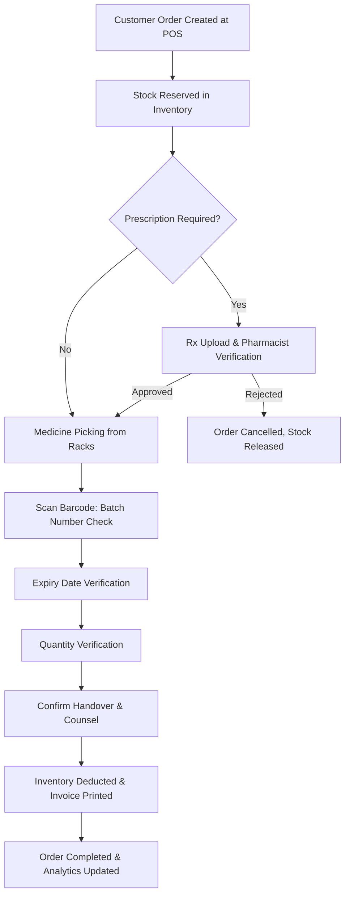
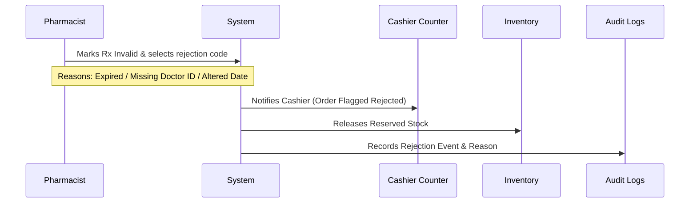

# Nexus AI - Pharmacist Functional Specification
**Enterprise Operating System for Multi-Branch Pharmacy Chains**

---

## 1. Pharmacist Role Overview

The Pharmacist is a licensed healthcare professional responsible for the safe, legal, and clinically accurate dispensing of medications within a single pharmacy branch. The pharmacist reviews prescription integrity, validates dosages, detects drug-drug interactions, coordinates clinical exclusions, and counsels patients on medicine usage.

The Pharmacist works strictly inside the branch. The role is focused on clinical validation and dispensing safety, completely isolated from administrative store management (Branch Manager), regional logistics (Regional Manager), and POS checkout/billing execution (Cashier).

### Purpose
To guarantee medication dispensing safety, clinical accuracy, and full regulatory compliance with CDSCO, Drugs & Cosmetics Act, and Schedule H/H1/X regulations.

### Core Responsibilities
* Verify that digital and physical prescriptions are authentic and currently valid.
* Pick, match, and verify medicine names, batch numbers, and expiry dates.
* Perform clinical safety checks: drug interactions, contraindications, and allergy flags.
* Record dispensing events immutably in compliance logs.
* Counsel customers on dosage, storage guidelines, and possible side effects.
* Approve clinically appropriate generic substitutions when prescribed brands are unavailable.

### Performance Goals & Operational KPIs

| KPI | Target | Measurement Frequency |
| :--- | :--- | :--- |
| **Dispensing Accuracy** | 100% (Zero dispensing errors) | Daily |
| **Prescription Verification Time** | < 3 minutes per prescription | Hourly |
| **Controlled Drug Log Accuracy** | 100% mismatch-free | Daily |
| **Allergy & Interaction Check Compliance** | 100% of orders checked | Daily |
| **Average Customer Counseling Time** | 1.5 to 3 minutes | Hourly |
| **Generic Substitution Rate** | ≥ 15% of out-of-stock brand prescriptions | Monthly |

### Schedule of Operations

#### Daily Responsibilities
* **Morning Roster Check:** Verify POS login and sync status. Review the pending dispensing queue.
* **Controlled Substances Handover:** Physically count and sign off on target Schedule X and narcotics stock counts inside the double-locked cabinet.
* **Verification Queue Processing:** Continually inspect, approve, or reject active prescriptions.
* **EOD Dispensing Audit:** Match physical prescription documents received today against digital orders. Sign off on the daily dispensing registry.

#### Weekly Responsibilities
* **Near-Expiry Audits:** Scan cold storage and fast-moving racks for batches expiring within 90 days. Flag them for reallocation or markdown.
* **Quarantine Management:** Move recalled or physically compromised batches to the branch quarantine area and log changes.

#### Monthly Responsibilities
* **Controlled Substances Ledger Review:** Reconcile monthly sales of Scheduled drugs against CDSCO form files.
* **Audit Trail Verification:** Review override audit logs where pharmacist overrides safety flags.

---

## 2. Medicine Dispensing Workflow



1. **Order Creation:** Cashier enters items in POS, creating a pending order.
2. **Reservation:** Inventory reserves the items, changing status from `AVAILABLE` to `RESERVED`.
3. **Rx Verification:** For Schedule H/H1/X medicines, the pharmacist inspects the uploaded prescription file.
4. **Picking:** Pharmacist picks physical boxes from racks.
5. **Batch/Expiry Check:** Pharmacist scans barcodes to verify batch number matches order reserve, and expiry date > 90 days.
6. **Quantity Matching:** Verify number of pills/bottles matches prescription.
7. **Handover & Counsel:** Pharmacist hands over medicine and reviews usage instructions with customer.
8. **Inventory Deduction:** Final transaction records, decrementing inventory.

---

## 3. Pharmacist Dashboard

The pharmacist dashboard focus is strictly on order verification, dispensing backlog, and clinical alerts.

```
+--------------------------------------------------------------------------+
| [ Topbar: Branch | Dispensing Status Indicator | Notifications | Profile ]|
+--------------------------------------------------------------------------+
|  [ Daily Dispensed: 142 ]  [ Avg Dispense Time: 2.1m ]  [ Pending Rx: 4 ]|
+--------------------------------------------------------------------------+
|  [ Pending Dispensing Queue ]       |  [ Prescription View Component ]   |
|  List of POS created orders        |  - Image / Patient Details        |
|  Select to verify & dispense       |  - Doctor validation portal       |
+--------------------------------------------------------------------------+
|  [ Medicine Stock Availability ]    |  [ Patient Safety Alerts ]        |
|  Fast SKU lookup & batch expiry    |  - Interaction Warnings           |
+--------------------------------------------------------------------------+
|  [ AI Recommendations & Guidance ]  | [ Controlled Substances Counter ]  |
+--------------------------------------------------------------------------+
```

### Dashboard Widgets

* **Pending Dispensing Queue:** List of orders waiting for pharmacist verification and medicine picking. Shows order draft time and customer priority.
* **Prescription Queue:** Filtered list of orders containing prescription-only drugs. Select a row to load the medicine details.
* **Reserved Inventory Count:** Counter of SKUs locked in billing but not yet dispensed.
* **Completed Orders Count:** Running total of items dispensed during the active shift.
* **Rejected Orders Grid:** Table of orders cancelled due to invalid doctor details or wrong prescriptions.
* **Fast Medicine Lookup:** Search bar to check local stock levels, shelf locations, and batch number distributions.
* **Expiry Alerts Ring:** Red/amber status ring displaying count of branch batches expiring within 90 days.
* **Controlled Substances Panel:** Shows stock counts of Schedule H1/X medicines. Requires physical counts verification twice daily.
* **Patient & Doctors Detail Card:** Displays patient notes, allergics flags, and doctor license credentials for active orders.
* **AI Generic Substitution Suggester:** High-confidence generic suggestions when the prescribed brand is out of stock.
* **Notifications Feed:** Real-time push notifications for urgent medicine recalls or new high-priority queue items.

---

## 4. Permissions (RBAC Matrix)

| Entity Name | Read | Create | Update | Delete | Approve / Reject |
| :--- | :---: | :---: | :---: | :---: | :---: |
| **Pending Orders** | Included | Excluded | Excluded | Excluded | Included (Rx Approval) |
| **Inventory Stock Levels** | Included | Excluded | Excluded | Excluded | Excluded |
| **Medicine Batches** | Included | Excluded | Included (Quarantine) | Excluded | Excluded |
| **Prescriptions Files** | Included | Included | Included | Excluded | Included |
| **Customer Medical Profiles** | Included | Included | Included | Excluded | Excluded |
| **Generic Substitutions** | Included | Excluded | Excluded | Excluded | Included |
| **Incident Reports / Discrepancies**| Included | Included | Included | Excluded | Excluded |
| **Reports (Dispensing Logs)** | Included | Included | Excluded | Excluded | Excluded |

---

## 5. Functional Modules

### A. Dispensing Queue
Centralized queue of draft POS orders. Displays order age, customer name, and number of items. Selecting an order locks it to the active pharmacist.

### B. Prescription Verification Portal
Interactive split-screen interface showing the digital prescription image on the left and order items on the right. BM validates physician registration ID and expiration date.

### C. Medicine Information & Substitution Engine
Lookup tool for any catalog SKU, detailing instructions, drug interactions, contraindications, and active equivalents.

### D. Customer Medical Profile
Searchable database of customer profiles detailing active prescriptions, chronic illnesses, allergies, and past orders.

### E. Batch & Expiry Auditor
Barcode scanner interface for matching picked medicines against database batch statuses. Blocks expired or recalled inventory from checkout.

### F. Reports & Logs Engine
Allows the pharmacist to export daily dispensing summaries and Schedule H1 ledger entries.

---

## 6. Prescription Management

### Prescription Validation Rules
Every prescription must undergo verification across these five elements:
1. **Physician Credentials:** Registry lookup verified via state medical council guidelines.
2. **Aged Check:** Maximum of 6 months from date of issue for standard drugs, 30 days for Schedule H, and 7 days for Schedule X.
3. **Dosage Integrity:** Validation of frequency and duration boundaries.
4. **Controlled Substance Compliance:** Schedule H1/X orders require patient phone number, doctor ID, and matching prescription scan.
5. **Relevance Match:** Medicine name matches the scanned image exactly or fits generic substitution rules.

### Prescription Rejection Flow


---

## 7. Medicine Dispensing Details

### Pick and Scan Verification
* **Step 1 (Shelf Pick):** System shows exact rack coordinate (e.g., A5-Rack 2). Pharmacist retrieves physical box.
* **Step 2 (Scan Match):** Scans product GS1 barcode.
* **Step 3 (Batch Validation):** Barcode validation confirms picked batch number matches reserved batch in database.
* **Step 4 (Expiry Lock):** If batch expiry date is less than current date, system triggers a loud audio-visual warning and freezes transaction.

### Handover Protocol
* Confirm patient identity via phone number verification.
* Print and apply dosage instruction labels directly onto package.
* Handover medicine and verify signature for Schedule H1/X substances.

---

## 8. Patient Safety & Clinical Decision Support

### Automated Contraindication Engine
* **Drug-Drug Interactions:** Flags dangerous combinations (e.g., Sildenafil + Nitroglycerin).
* **Allergy Check:** Compares customer profile allergy list against chemical components.
* **Duplicate Therapy:** Flags duplicate drug categories in current order (e.g., prescribing two similar NSAIDs).
* **Pregnancy Alerts:** Blocks Category X drugs for pregnant patients.
* **Age Restrictions:** Warns or blocks pediatric usage for adult-formulated pills.

```
+-------------------------------------------------------------+
|               🚨 DRUG INTERACTION ALERT                      |
+-------------------------------------------------------------+
|  Detected: Sildenafil (Active Order) + Nitroglycerin (Rx)   |
|  Severity: CRITICAL                                         |
|  Risk: Dangerous blood pressure drop.                       |
+-------------------------------------------------------------+
|  [ Cancel Order ]                    [ Override with Note ] |
+-------------------------------------------------------------+
```

---

## 9. Customer Interaction & Counselling

The counseling checklist is integrated into the final dispense confirmation screen:
* **Dosage & Frequency:** Clarify when to take (e.g., before/after food).
* **Storage Instructions:** Highlight cold chain requirements (insulin at 2–8°C).
* **Missed Dose Action:** Advise what to do if a dose is missed.
* **Common Side Effects:** Warn about drowsiness or nausea precautions.
* **Adherence Reminder:** Set up automated text alerts for refill cycles.

---

## 10. AI Integration

* **Inventory AI:**
  * *Inputs:* Active stock status, local weather warnings, regional disease spikes.
  * *Outputs:* Inbound transfer suggestions for high-demand molecules before shortages occur.
* **Prescription AI (OCR Parse):**
  * *Inputs:* Handwritten or digital prescription scans.
  * *Outputs:* Suggested list of molecules, dosages, and doctor license matches.
  * *Confidence:* Confidence score (0–100%). Low confidence (<85%) requires manual input.
* **Clinical Decision Support:**
  * AI suggests equivalent alternatives when a prescribed medicine is out of stock.

---

## 11. Reports

* **Daily Dispensing Log:** Details all scripts cleared with active pharmacist signature.
* **H1 Compliance Registry:** Formats and prints Schedule H1 book containing details of buyer name, doctor, and molecules.
* **Near Expiry Log:** List of batches within 90 days.
* **Safety Override Logs:** Audit log of safety interaction warnings bypassed by the pharmacist (including notes).

---

## 12. Notifications

* **New Dispensing Request:** Pushes audio-visual ping on dashboard when cashier submits order.
* **Medicine Recall:** Immediate full-screen alert blocking recalled batch barcode scans.
* **Cold Storage Break:** Alert triggered when refrigerator temperature leaves the 2–8°C range.
* **Low Stock Alarm:** Triggers when essential emergency molecules drop below safety limits.

---

## 13. Global Search

Index scope covers:
* **Medicines:** Generic name, brand, chemical type, schedule, available batch list.
* **Customers:** Medical history, phone number, old prescriptions.
* **Dispensing History:** Past verified orders filtering by pharmacist id or date.

---

## 14. Analytics

### Performance Metrics
* Active dispensing queue length trends.
* Average time taken to review, pick, scan, and dispense.
* Prescription approval vs. rejection ratio.
* Percentage of generic substitutions recommended and implemented.

---

## 15. Security & Access Control

* **MFA Verification:** Required for credentials validation on login.
* **Row-Level Security (RLS):** REST API calls enforce branch limits.
* **Audit Trails:** All dispense operations, overrides, and cancellations are saved with timestamps.
* **Controlled Substance Tracking:** Schedule X dispenses require dual-signature (BM + Pharmacist) credentials for checkout validation.

---

## 16. API Specifications

### GET `/api/pharmacist/queue`
* **Purpose:** Returns list of pending orders ready for dispensing validation.
* **Response (200 OK):**
```json
[
  {
    "order_id": "o1111111...",
    "order_no": "ORD-2026-8812",
    "status": "PENDING_DISPENSING",
    "items_count": 3,
    "has_prescription": true,
    "created_at": "2026-07-06T16:20:00Z"
  }
]
```

### POST `/api/pharmacist/dispense`
* **Purpose:** Validates scans, logs signatures, and updates database inventory.
* **Request Body:**
```json
{
  "order_id": "o1111111...",
  "pharmacist_signature": "d2222222...",
  "items": [
    { "medicine_id": "m1111...", "batch_no": "B20261101", "quantity": 10 }
  ]
}
```
* **Response (200 OK):**
```json
{ "status": "DISPENSED", "invoice_id": "i3333333..." }
```

### POST `/api/pharmacist/orders/{order_id}/reject`
* **Purpose:** Rejects prescription order, releasing stock.
* **Request Body:**
```json
{ "rejection_code": "EXPIRED_RX", "reason": "Date shows 2025-10" }
```
* **Response (200 OK):**
```json
{ "status": "REJECTED", "order_id": "o1111...", "stock_released": true }
```

---

## 17. Database Tables Accessed

* `orders` & `order_items` (Read / Update): Updates order status.
* `inventory` & `medicine_batches` (Read / Update): Reduces quantity.
* `prescriptions` (Read / Write / Update): Links digitized prescription documents.
* `audit_logs` (Write-Only): Immutable log of validation events.

---

## 18. UI / UX Design

* **Dispensing Screen:** Three columns: Column 1 (Pending queue), Column 2 (Active prescription scan), Column 3 (Order verification and scanner confirmation checklist).
* **Accessibility:** Large typeface contrast. Clean, visible markers for warnings (Drug Interaction alerts are red, Warnings are amber).

---

## 19. Real-World Pharmacy Use Cases

* **Controlled Drugs (Schedule X):** Pharmacist reviews hard copy prescription, matches physical and digital scans, logs doctor registration ID, opens double-locked cabinet for Schedule X drug, scans barcode, and completes transaction.
* **Generic Substitution:** Prescribed drug is OOS. Pharmacist validates generic equivalency, prompts customer, updates transaction item to generic counterpart, and completes transaction.
* **Partial Dispensing:** Customer requests only 5 tablets of a 10-tablet prescription. Pharmacist adjusts quantity downwards, updates inventory reservation, dispenses 5 units, and records discrepancy.

---

## 20. Demo Walkthrough

```
[Login Page] --> Authenticate credentials --> [Dashboard]
                                                  |
                                                  v
[Active Queue] <-- Click row "ORD-2026-8812" <--- [Pending Queue]
      |
      v
[Split Screen] --> Verify prescription image matches item count
      |
      v
[Pick & Scan] --> Scan box barcode --> Match batch & expiry dates
      |
      v
[Counsel Box] --> Confirm dosage instructions --> Click Dispense
      |
      v
[Receipt View] --> Confirm print invoice --> Inventory updated
```

---

## 21. Acceptance Criteria

* **Safety Block:** If an expired batch is scanned during picking, system must block invoice generation.
* **Dispense Latency:** Under 3 seconds to commit final stock updates and print invoice.
* **Prescription Audit:** Every Schedule H1/X order must have a verified doctor registry ID saved.
* **Automatic Rollback:** If network connection fails during dispensing API execution, rollback transaction.

---

## 22. Edge Cases

* **Doctor Registry Issues:** National registry service is down. Pharmacist can perform temporary override by entering license ID manually.
* **Simultaneous Pick Conflict:** Two pharmacists attempt to scan and dispense the same medicine batch. The system uses row locks to process the first scanner and rejects the second with an "Item stock locked" message.
* **Customer Return Attempt:** Safe clinical regulations require blocking all returns on dispensed insulin or cold chain products once they leaves store environment.

---

## 23. Production Readiness Checklist

- [ ] Row lock performance validated under concurrent API load.
- [ ] OCR engine response times verified under 2 seconds.
- [ ] H1 registry ledger formatting aligns with CDSCO guidelines.
- [ ] Offline local stock verification cache tested.
- [ ] Refrigerator temperature telemetry alerts configured.
