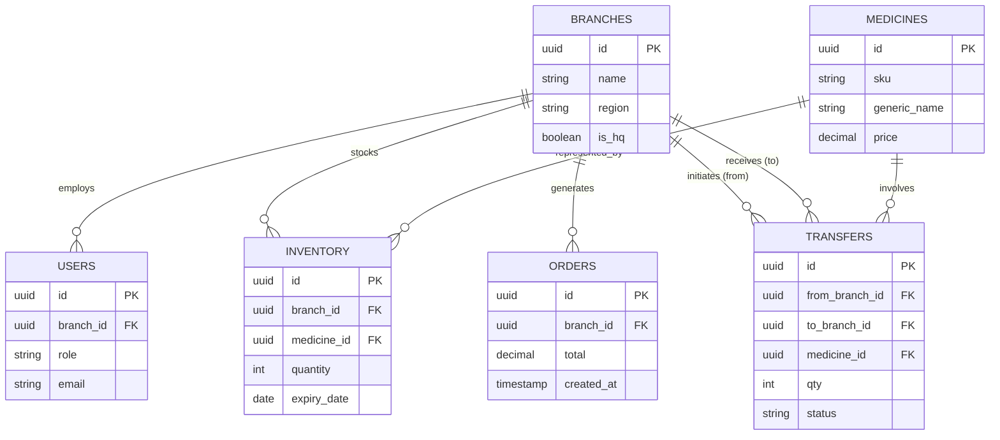

# Nexus AI - Database Design

| Metadata | Details |
| :--- | :--- |
| **Document Purpose** | Relational Database Architecture specification |
| **Data Platform** | Supabase Postgres 15+ |
| **Document Owner** | Principal Data Architect |
| **Version** | 1.0.0 |
| **Date** | 2026-07-03 |

---

## 1. ER Diagram


## 2. Database Architecture
Nexus AI relies on strict relational logic handled via Supabase (PostgreSQL). The architecture prioritizes data immutability for critical states (Orders, Transfers) and strict isolation using native Row-Level Security (RLS) to enforce multi-branch tenanting.

## 3. Tables & 4. Columns

### `core.branches`
| Column | Type | Constraints | Description |
| :--- | :--- | :--- | :--- |
| `id` | UUID | PK, Default `uuid_generate_v4()` | Unique Branch Identifier |
| `name` | VARCHAR(100) | NOT NULL | "NexusCare - Banjara Hills" |
| `is_hq` | BOOLEAN | Default FALSE | HQ designation for CEO analytics |

### `core.users`
| Column | Type | Constraints | Description |
| :--- | :--- | :--- | :--- |
| `id` | UUID | PK, References `auth.users` | Supabase Auth UUID match |
| `branch_id` | UUID | FK | Null means CEO/Global role |
| `role` | ENUM | NOT NULL | 'CEO', 'BRANCH_MANAGER', 'PHARMACIST' |

### `inventory.medicines` (Master SKU catalog)
| Column | Type | Constraints | Description |
| :--- | :--- | :--- | :--- |
| `id` | UUID | PK | Global Internal ID |
| `sku` | VARCHAR(50) | UNIQUE, NOT NULL | Standardized barcoding |
| `generic_name` | VARCHAR(255) | Indexed | E.g., 'Paracetamol 500mg' |

### `inventory.stock`
| Column | Type | Constraints | Description |
| :--- | :--- | :--- | :--- |
| `id` | UUID | PK |  |
| `branch_id` | UUID | FK | Where it currently resides |
| `medicine_id` | UUID | FK | What the item is |
| `quantity` | INT | Check >= 0 | Cannot have negative stock |
| `expiry_date` | DATE | NOT NULL | Critical for AI FEFO warnings |

### `ops.transfers`
| Column | Type | Constraints | Description |
| :--- | :--- | :--- | :--- |
| `id` | UUID | PK |  |
| `from_branch_id`| UUID | FK | Sending Branch |
| `to_branch_id` | UUID | FK | Receiving Branch |
| `medicine_id` | UUID | FK | Item being moved |
| `qty` | INT | Check > 0 | Amount |
| `status` | ENUM | PENDING, APPROVED, SHIPPED | LangGraph triggers on transition |

## 5. Relationships, 8. Primary Keys & 9. Foreign Keys
*   `USERS` inherently map 1:1 against the underlying Supabase Auth infrastructure. 
*   `INVENTORY` relies on compound logic (Medicine + Branch) allowing multiple expiry batches for identical Medicine IDs within the same branch.
*   Cascade deletes are **forbidden** across `TRANSFERS` and `ORDERS` to maintain absolute auditor trails.

## 6. Indexes
*   `B-Tree` Index on `inventory.stock(branch_id)` for rapid dashboard loading.
*   `B-Tree` Index on `inventory.stock(expiry_date)` allowing AI to instantly fetch <30 days expiries network-wide.
*   `GIN` Index natively applied to vector embeddings within ChromaDB (external to Postgres).

## 7. Constraints (Business Rules in SQL)
*   `stock_non_negative`: `CHECK (quantity >= 0)` - A hard SQL constraint preventing the LangGraph AI from accidentally authorizing negative warehouse figures.
*   Self-transfer blocks: `CHECK (from_branch_id != to_branch_id)` in the transfers table.

## 10. Normalization
Data is structured closely matching 3NF (Third Normal Form). 
*   Medicine names and prices are extracted strictly to the `medicines` table to avoid massive string duplication in the highly volatile `stock` table. Price aggregates for `ORDERS` are stored at execution time to preserve historical context (preventing retroactive profit shifts if `medicines.price` is altered).

## 11. Sample Records
**`inventory.stock` Table Snippet:**
```json
[
  {
    "id": "a1b2...",
    "branch_id": "nexus-branch-4",
    "medicine_id": "med-amoxicillin-500",
    "quantity": 140,
    "expiry_date": "2027-01-15" 
  }
]
```

## 12. Migration Strategy
Migrations are managed via the Supabase CLI (`supabase migration up`). 
No arbitrary SQL execution is allowed in production. Every database alteration exists as a timestamped migration file stored in `packages/database/migrations/` inside the monolithic repository.

## 13. Backup Strategy
*   **Point in Time Recovery (PITR):** Managed via Supabase cloud with arbitrary rollbacks supported up to 7 days for the MVP tier.
*   **Daily Dumps:** Logical `pg_dump` backups pushed automatically to isolated cold AWS S3 storage at 03:00 IST for ultimate disaster recovery.

## 14. Database Security
*   **Encryption:** Data at rest encrypted via AES-256. 
*   **Row Level Security (RLS) Rules:**
    *   *CEO:* `CREATE POLICY ceo_read_all ON inventory FOR SELECT USING ( auth.uid() IN (SELECT id FROM users WHERE role = 'CEO') )`
    *   *Branch Manager:* `CREATE POLICY manager_local ON inventory FOR ALL USING ( branch_id = (SELECT branch_id FROM users WHERE id = auth.uid()) )`
