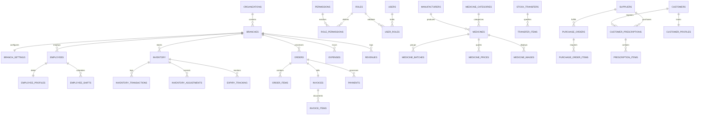

# Nexus AI — Database Architecture Documentation

## 1. Folder Structure

All assets for the Relational and Vector database configurations reside in the `packages/database` workspace folder:

```
packages/database/
├── migrations/
│   ├── 20260703010000_init_schema.sql         # 15 Modules tables, types, constraints, and indexes
│   ├── 20260703020000_views_and_triggers.sql    # Trigger automation ledgers, view aggregates, and RAG/FEFO analytics
│   └── 20260703030000_security_rls.sql        # RLS policies and JWT/context helper utilities
├── seed.sql                                   # Hyderabad baseline and procedural seed data generator
└── README.md                                  # This document
```

---

## 2. Naming Conventions

To maintain relational consistency across corporate chains and developers, Nexus AI strictly enforces the following patterns:
* **Table Names**: Pluralized, snake_case (`organizations`, `branch_settings`, `purchase_orders`).
* **Column Names**: Lowercase snake_case (`id`, `branch_id`, `created_at`).
* **Foreign Keys**: Named as `<singular_parent_table>_id` matching parent table name (e.g. `branch_id REFERENCES branches(id)`).
* **INDEX Naming**: Prefix `idx_` followed by `<table_name>_<columns>` (e.g. `idx_medicines_category`).
* **Trigger Naming**: Prefix `tr_` followed by action description.
* **Primary Key IDs**: Strictly `UUID` utilizing `uuid_generate_v4()`.
* **Financial Values**: Stored in `NUMERIC(12, 2)` or `NUMERIC(15, 2)` to eliminate floating-point precision drifts.

---

## 3. Entity-Relationship Diagram (Mermaid ER)

Here is the database relational topology:



---

## 4. Relationship Documentation

The architecture divides into relational domains:

### A. Core Multi-Tenant Topology
Each enterprise manages a single `organizations` entry. Under this entity, retail boundaries are drawn via `branches`. Branch settings (`branch_settings`) configure pricing thresholds, automated transfers, and timezone defaults.

### B. Access Control & Authorization (RBAC)
User representation in the schema operates via `users` which matches 1:1 to Supabase's `auth.users` UUID identifier. The `user_roles` cross-references user accounts to `roles` (CEO, ADMIN, Manager, etc.), which are linked to specific operational codes in `permissions` via `role_permissions`.

### C. Master SKU and Inventory
`medicines` defines global SKU variables (chemical structures, dosage formats, strengths). Stock is distributed via `inventory` which links to a specific `branches`, `medicines`, and specific `medicine_batches` ensuring Batch-Specific FEFO validation.

### D. Logistics and Ordering (POS)
`orders` tracks checkout flow. Each sale creates an immutable invoice (`invoices`) to ensure legal fiscal auditing. Whenever quantity limits inside `inventory` change, database triggers insert detail records to `inventory_transactions` ensuring historical integrity.

---

## 5. Indexing Strategy

Optimal lookup speeds are achieved via targeted Postgres indexes:
* **Composite Query B-Trees**: `idx_inventory_lookup` on `inventory(branch_id, medicine_id)` accelerates regional stock checks.
* **Low-Latency Search**: `idx_medicines_search_composite` on `medicines(brand_name, substance_name, sku)` ensures fast semantic or physical search queries.
* **Date Bounds**: `idx_medicine_batches_expiry` on `medicine_batches(expiry_date)` allows system agents to scan expiration lists instantly.
* **High-Speed Joins**: Composite indexes on `user_roles(user_id, role_id)` speed up authorization lookup.
* **AI Embeddings Vector Search**: `idx_embeddings_vector` on `embeddings` tables using **HNSW index** (`vector_cosine_ops`) optimizes semantic matching for local RAG knowledge documents using 1536-dimension embeddings.

---

## 6. Backup and Recovery Strategy

Nexus AI aligns with enterprise business continuity levels:
* **Logical Database Dumps (`pg_dump`)**: Scheduled daily at 03:00 IST using cron parameters. Backups are highly compressed and uploaded to encrypted AWS S3 buckets (retained for 30 days).
* **Point-in-Time Recovery (PITR)**: Enabled natively in Supabase Cloud. Enables granular transaction replays to restore any state down to the millisecond within a 7-day trailing window.
* **Multi-Region Disaster Recovery (DR)**: Periodic copy of primary snapshots to standby replica nodes to cover regional outages.
* **Integrity Checks**: Automated verification scripts run restore tasks in isolated dev sandboxes weekly to confirm data integrity.
